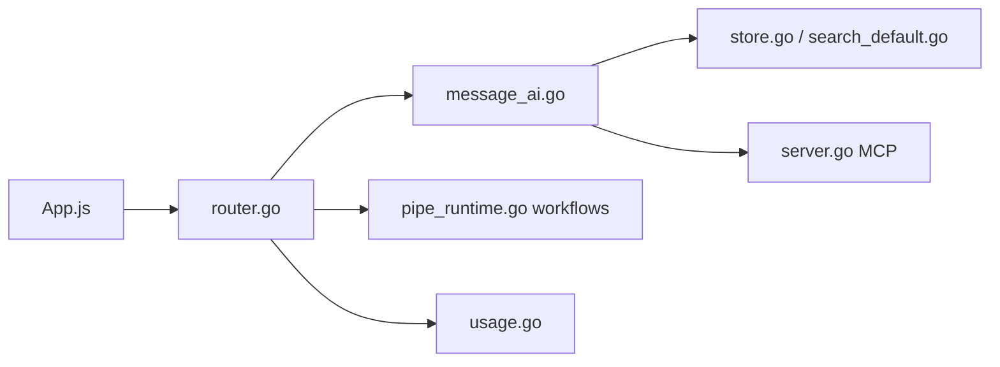

# casibase/casibase

> Assistant IA personnel auto-hébergeable (LLM, RAG, agents), livré en un binaire ; le README le nomme OpenAgent.

## Le problème
Réunir plusieurs fournisseurs de modèles, une base de connaissances et des agents outillés dans une plateforme que l'on héberge soi-même.

## Ce que ça fait vraiment
Interface web pour discuter avec plus de 30 fournisseurs de LLM, un RAG (ingestion de PDF, Word, Excel, découpage, embeddings, recherche sémantique), des agents (navigateur, shell, Office, recherche web, MCP) et un éditeur de workflows BPMN avec tâches planifiées. Ajoute SSO (OIDC, OAuth2, LDAP, SAML), multi-tenant, journaux d'audit et suivi d'usage par modèle.

## Comment c'est branché


## Essayer
```bash
curl -fsSL https://raw.githubusercontent.com/the-open-agent/openagent/master/scripts/install.sh | bash
docker-compose up
```
Puis ouvrir http://localhost:14000.

## Coût et pièges
Gratuit, mais les appels aux fournisseurs de modèles restent à ta charge. Le README utilise `curl | bash` et pointe vers un autre dépôt (the-open-agent/openagent) : le nom du dépôt analysé ne correspond pas à celui du produit. Build depuis les sources : Go 1.25+, Node 20+, Yarn.

## Ce que ce n'est pas
Pas un framework d'agents pour développeurs : c'est une application complète, avec ses choix d'interface et d'authentification.

## Alternatives
Aucune alternative citée dans le README.

## Pour toi
À surveiller : pratique comme banc d'essai RAG et MCP multi-modèles, mais l'écart de nom avec le dépôt invite à vérifier l'origine avant d'installer.

