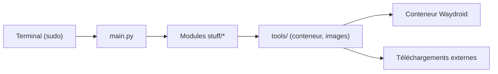

# casualsnek/waydroid_script

> Script Python qui ajoute GApps, Magisk, traduction ARM et autres extras à Waydroid.

## Le problème
Waydroid livré nu manque de services Google, de traduction ARM et de DRM pour faire tourner beaucoup d'applications.

## Ce que ça fait vraiment
CLI (`main.py`) avec sous-commandes `install`, `uninstall`, `hack`, `certified` : GApps, Magisk, libndk, libhoudini, Widevine L3, microG, SmartDock, certificat CA auto-signé, correctifs de permissions. Modules par fonctionnalité, binaires `resetprop` par architecture.

## Comment c'est branché


## Essayer
```bash
git clone https://github.com/casualsnek/waydroid_script
cd waydroid_script
python3 -m venv venv
venv/bin/pip install -r requirements.txt
sudo venv/bin/python3 main.py install gapps
```

## Coût et pièges
Exécution en root ; `lzip` requis. Le hack `nodataperm` remplace `service.jar` et peut empêcher Waydroid de démarrer. L'enregistrement de l'appareil auprès de Google demande un compte.

## Ce que ce n'est pas
Pas un outil de gestion Android complet. Le certificat MITM et les hacks de permissions (777) affaiblissent la sécurité du conteneur.

## Alternatives
- waydroid-magisk : recommandé pour une gestion Magisk plus poussée.

## Pour toi
À ignorer : utilité limitée à Waydroid sur poste Linux, sans lien avec le métier data/IA/MLOps.

