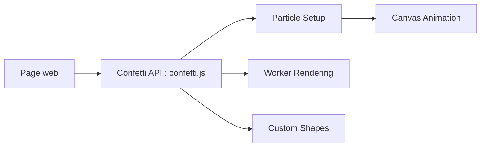

# catdad/canvas-confetti

> Bibliothèque navigateur d'animation de confettis sur canvas, appelée depuis une page web.

## Le problème
Ajouter un effet de célébration à une page sans écrire un moteur de particules.

## Ce que ça fait vraiment
La fonction `confetti(options)` crée des particules (nombre, angle, étalement, gravité, couleurs, formes carré/cercle/étoile, chemins SVG ou emoji), les anime sur un canvas et renvoie une promesse. `confetti.create` cible un canvas précis, avec rendu optionnel en web worker. Une option `disableForReducedMotion` respecte les préférences de mouvement.

## Comment c'est branché


## Essayer
```bash
npm install --save canvas-confetti
```
```html
<script src="https://cdn.jsdelivr.net/npm/canvas-confetti@1.9.4/dist/confetti.browser.min.js"></script>
```

## Coût et pièges
Gratuit. Avec `useWorker: true`, le canvas est transféré au worker et ne peut plus être manipulé. Ne tourne pas dans Node.

## Ce que ce n'est pas
Pas un outil de visualisation de données. Les confettis chaotiques peuvent gêner : activer `disableForReducedMotion`.

## Alternatives
- Aucune alternative nommée dans le README.

## Pour toi
À ignorer : gadget visuel, sans usage dans un flux data/IA ou MLOps.

