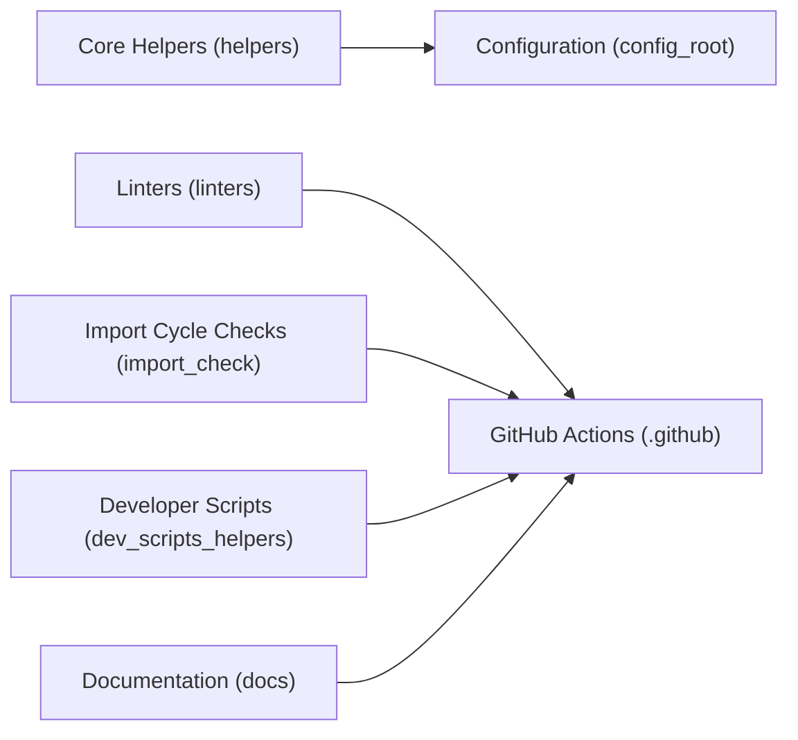

# causify-ai/helpers

> Boîte à outils Python de Causify : utilitaires, linters et automatisations pour dépôts de production.

## Le problème
Les équipes accumulent des scripts et bouts de code dupliqués et peu testés pour les E/S, Git, Docker ou pandas.

## Ce que ça fait vraiment
Un paquet `helpers/` de petits modules nommés `h*.py` (hdbg, hio, hsystem, hgit, hdocker, hpandas…) plus des wrappers LLM (`hllm`, `hllm_cost`, `hllm_cli`) pour complétions, sorties structurées, cache et suivi des coûts. S'y ajoutent `config_root/`, des scripts dev, des linters, un contrôle des imports, des workflows CI, des notebooks et un site MkDocs.

## Comment c'est branché


## Essayer
```bash
git submodule add https://github.com/causify-ai/helpers.git helpers_root
python -m venv .venv
source .venv/bin/activate
pip install -e .
pytest -q
```

## Coût et pièges
Gratuit ; les fonctions LLM utilisent OpenAI ou OpenRouter, donc clés et coûts d'API. Les 164 issues ouvertes suggèrent un chantier actif ; l'API interne peut bouger.

## Ce que ce n'est pas
Pas un framework : un fourre-tout de modules internes, avec une documentation dispersée. Non conçu comme dépendance stable publiée.

## Alternatives
Aucune alternative nommée dans le README.

## Pour toi
Surveiller : quelques modules (hllm avec suivi de coût, hpandas) peuvent inspirer, mais mieux vaut copier des idées que dépendre du dépôt entier.
