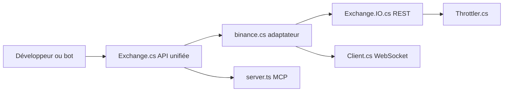

# ccxt/ccxt

> API unifiée pour interroger et trader plus de 100 plateformes crypto, en huit langages, pour développeurs et bots.

## Le problème
Chaque plateforme a sa propre API, ses noms de champs et ses limites de débit ; comparer ou trader sur plusieurs demande une intégration par plateforme.

## Ce que ça fait vraiment
CCXT fournit une classe par plateforme avec les mêmes méthodes (`loadMarkets`, `fetchTicker`, `createOrder`…) et des résultats normalisés, en REST et en WebSocket (versions « pro »). Le code est écrit en TypeScript puis transpilé vers Python, PHP, C#, Go, Java et Rust. Il gère la signature des requêtes et la limitation de débit (leaky bucket ou fenêtre glissante). Un CLI et un serveur MCP s'ajoutent.

## Comment c'est branché


## Essayer
```bash
pip install ccxt
npm install ccxt
npm i ccxt-cli -g
ccxt explain createOrder
claude mcp add ccxt -- npx -y ccxt-mcp
```

## Coût et pièges
Données publiques sans clé ; trading et solde exigent des clés d'API créées chez chaque plateforme. Sur les plateformes « builder code », 1 point de base est ajouté aux frais (désactivable avec `builderFee = False`). Les commandes de trading agissent sur de vrais fonds.

## Ce que ce n'est pas
Ni un service ni un serveur, et il ne détient pas les fonds : un logiciel non custodial, sans garantie (MIT). Il ne crée ni comptes ni clés à ta place.

## Alternatives
- Freqtrade : un bot de trading algorithmique complet plutôt qu'une bibliothèque.
- OctoBot : bot avec interface web avancée.
- TokenBot : copie de traders algorithmiques.

## Pour toi
Adopter pour collecter des cotations, carnets d'ordres et historiques OHLCV multi-plateformes vers tes pipelines, en gardant le trading réel sous un contrôle séparé.

