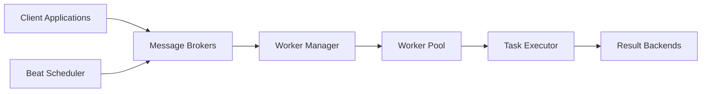

# celery/celery

> File de tâches distribuée en Python, pour exécuter du travail en arrière-plan sur des workers.

## Le problème
Les traitements longs (ETL, inférence, envois) bloquent une application web s'ils ne sont pas déportés vers des workers pilotés par un broker.

## Ce que ça fait vraiment
Le client publie une tâche dans un broker (RabbitMQ, Redis, SQS, Pub/Sub) ; des workers la consomment et stockent le résultat dans un backend.
Pools prefork, eventlet, gevent ou solo ; Beat pour les tâches périodiques.
Backends de résultats : Redis, SQLAlchemy, Django ORM, S3, GCS, Elasticsearch…
Extras pip par fonctionnalité (`celery[redis]`, `celery[sqs]`…).

## Comment c'est branché


## Essayer
```bash
pip install -U Celery
pip install "celery[redis]"
```

## Coût et pièges
Gratuit mais nécessite un broker (RabbitMQ ou Redis) à opérer. Windows non supporté officiellement. v5.6 est la dernière à supporter Python 3.9.

## Ce que ce n'est pas
Pas un orchestrateur de workflows ML (pas de DAG visuel ni de lineage). Les transports hors RabbitMQ/Redis sont expérimentaux.

## Alternatives
- node-celery, gocelery, rusty-celery : clients du même protocole dans d'autres langages, pas des remplaçants.

## Pour toi
Adopter : standard de fait pour déporter inférence et jobs batch derrière une API FastAPI ; licence BSD selon le README, à confirmer dans le fichier LICENSE.
