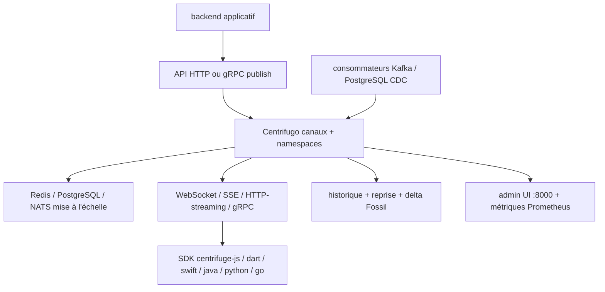

# centrifugal/centrifugo

> Serveur de messagerie temps réel PUB/SUB, agnostique du langage, entre votre backend et vos clients.

## Le problème
Ajouter du temps réel à une application mêle la logique métier au transport, et chaque plateforme cliente réclame son implémentation de reconnexion et de reprise.
Tenir beaucoup de connexions simultanées demande un travail d'infrastructure qui n'est pas le métier de l'application.

## Ce que ça fait vraiment
Sépare le transport temps réel du backend : le backend publie dans des canaux par API HTTP ou gRPC, les clients s'abonnent via un SDK officiel ou en unidirectionnel sans SDK.
Transports : WebSocket, HTTP-streaming, Server-Sent Events, gRPC, WebTransport (expérimental), avec multiplexage des abonnements sur une seule connexion.
Passage à l'échelle par Redis (ou compatible : Valkey, KeyDB, DragonflyDB, Elasticache), PostgreSQL ou NATS ; consommateurs asynchrones PostgreSQL et Kafka pour outbox transactionnel et CDC.
Historique de messages avec reprise automatique à la reconnexion, mode cache, compression delta (algorithme Fossil), présence en ligne avec notifications join/leave, RPC vers le backend, authentification JWT ou par proxy, UI d'administration et métriques Prometheus avec dashboard Grafana.

## Comment c'est branché


## Essayer
```bash
docker run -it --rm -p 8000:8000 centrifugo/centrifugo:latest centrifugo \
  --client.insecure --admin.enabled --admin.insecure
```

## Coût et pièges
Gratuit ; le coût est l'hébergement, plus un Redis, PostgreSQL ou NATS dès que vous passez à plusieurs instances.
Les options `--client.insecure` et `--admin.insecure` de la commande de démonstration suppriment l'authentification : le README interdit explicitement leur usage en production.

## Ce que ce n'est pas
Pas un bus de messages interne : c'est un PUB/SUB tourné vers les utilisateurs, pas un remplaçant de Kafka — qu'il consomme au contraire.
Pas un backend : il ne porte aucune logique métier, il transporte.
WebTransport est marqué expérimental, et le SDK .NET/MAUI/Unity est marqué WIP.

## Alternatives
Aucune alternative nommée ; le README affirme fournir des fonctions absentes des autres solutions open source sans les citer.

## Pour toi
Utile pour diffuser des réponses de modèle en flux vers des clients variés sans écrire la couche transport.
