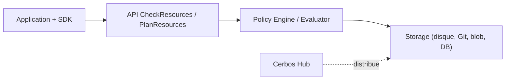

# cerbos/cerbos

> Serveur de décision d'autorisation qui évalue des politiques YAML pour contrôler l'accès aux ressources.

## Le problème
Les règles d'accès finissent codées en dur dans l'application, difficiles à auditer et à faire évoluer.

## Ce que ça fait vraiment
Le PDP Cerbos est un service sans état qui charge des politiques YAML (disque, Git, stockage objet ou base) et expose deux APIs : `CheckResources` (ce principal peut-il agir ?) et `PlanResources` (quelles ressources sont accessibles ?). Il gère RBAC et ABAC via conditions, rôles dérivés et politiques de principal. Des SDK existent en huit langages, et des adaptateurs de plan de requête pour Prisma et SQLAlchemy.

## Comment c'est branché


## Essayer
```bash
cat <<EOF | curl --silent "http://localhost:3592/api/check/resources?pretty" -d @-
{ "requestId": "test01", "principal": {"id": "alicia", "roles": ["user"]},
  "resources": [{"actions": ["view"], "resource": {"id": "XX125", "kind": "album:object",
  "attr": {"owner": "alicia", "public": false, "flagged": false}}}] }
EOF
```

## Coût et pièges
Le PDP est gratuit ; Cerbos Hub est un service cloud à compte. Télémétrie anonyme active par défaut, à couper avec `CERBOS_NO_TELEMETRY=1`.

## Ce que ce n'est pas
Ce n'est pas un fournisseur d'identité ni un système d'authentification : il décide seulement des permissions.

## Alternatives
Aucune alternative nommée dans le README.

## Pour toi
À surveiller : pertinent si tu exposes des API ou des agents nécessitant des permissions fines et auditables ; hors de ce cas, c'est une brique de plus à opérer.
