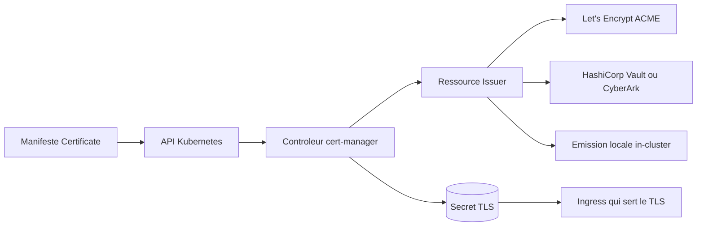

# cert-manager/cert-manager

> **TLS certificates as Kubernetes resources**, for cluster operators who no longer want to renew them by hand.

## The problem

Without it, a TLS certificate in a cluster is a hand-placed secret with an expiry date nobody
watches: the outage arrives the day it expires. The README frames exactly that repetitive
work — obtaining, renewing, using certificates — as the toil it removes.

## What it actually does

It adds certificates and certificate issuers as resource types in Kubernetes clusters. From
there, the cluster itself declares the certificate it wants, and cert-manager goes and gets it.
It can issue from several sources named in the README: Let's Encrypt over ACME, HashiCorp
Vault, CyberArk Certificate Manager, and local in-cluster issuance. It then keeps certificates
valid, attempting renewal at an appropriate time before expiry. The headline use case in the
README is automatic TLS issuance for Ingress resources.

## How it is wired



You declare a resource in the Kubernetes API; the controller picks it up, uses the declared
issuer, obtains the certificate from that source and writes it into a TLS secret that the
Ingress consumes. The README does not describe the code layout — only these concepts are
named, and the overview diagram is hosted on the project website.

## Trying it

```bash
# no command is documented in the README
```

The README carries no commands at all: installation is pointed at the cert-manager.io
Installation page, which advertises several supported methods, plus a getting started guide
and an nginx-ingress quick start. Nothing to copy from here.

## Cost and traps

The project costs nothing, but it assumes a working Kubernetes cluster and, in the common
case, an external issuer: Let's Encrypt over ACME, Vault or CyberArk Certificate Manager.
Quotas and terms of those issuers are outside the repo and undocumented in the README.
Explicit trap for developers: the README warns there is **no Go module compatibility
guarantee**, that most code under `pkg/` may break even across minor or patch releases, and
that the import path changed (`github.com/jetstack/cert-manager` before 1.8,
`github.com/cert-manager/cert-manager` since). Development is supported on Linux and macOS,
with extra requirements on macOS.

## What it is not

It is not a certificate authority: it requests certificates from issuers rather than being
one, apart from the local in-cluster issuance mode. It is not a Go library to import — the
README says plainly that the exported `pkg/` surface is unstable. And it is not a standalone
tool outside Kubernetes: its whole model rests on resource types added to a cluster.

## Alternatives

- **jetstack/kube-lego** — named in the README as the work cert-manager is loosely based upon;
  historical, worth a look only to understand the lineage.
- **PalmStoneGames/kube-cert-manager** — the other similar project cited in the README's
  History section, from which some ideas were borrowed.
- Among the supplied neighbours none is comparable: teleport, metallb, flyte and KubeArmor
  also live in Kubernetes but do not handle certificate issuance.

## For you

Little direct bearing on a data pipeline or model training, but if you expose services —
inference APIs, MLflow, notebooks, internal dashboards — behind an Ingress, this is the piece
that prevents the Sunday-night TLS outage. A CNCF-tracked project under Apache-2.0: adopt it
on the platform side, but do not import it as a library.
