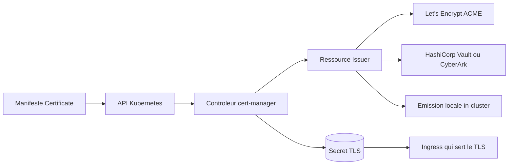

# cert-manager/cert-manager

> **Les certificats TLS comme ressources Kubernetes**, pour qui exploite un cluster et ne veut plus les renouveler à la main.

## Le problème

Sans lui, un certificat TLS dans un cluster est un secret posé à la main, avec une date
d'expiration que personne ne surveille : la panne arrive le jour où il expire. Le README
décrit exactement ce travail répétitif — obtenir, renouveler, utiliser — comme ce qu'il
cherche à supprimer.

## Ce que ça fait vraiment

Il ajoute au cluster des types de ressources : des certificats et des émetteurs de
certificats. À partir de là, c'est le cluster lui-même qui décrit le certificat voulu, et
cert-manager se charge de l'obtenir.
Il sait émettre depuis plusieurs sources citées par le README : Let's Encrypt via ACME,
HashiCorp Vault, CyberArk Certificate Manager, et une émission locale interne au cluster.
Il surveille ensuite la validité et tente le renouvellement à un moment jugé approprié avant
l'expiration, pour éviter la coupure. Le cas d'usage mis en avant par le README est l'émission
automatique de certificats pour des ressources Ingress.

## Comment c'est branché



On déclare une ressource dans l'API Kubernetes ; le contrôleur la voit, choisit l'émetteur
déclaré, obtient le certificat auprès de la source correspondante et le dépose en secret TLS,
que l'Ingress consomme. Le README ne détaille pas l'arborescence du code : seuls les concepts
ci-dessus y sont nommés, et le schéma d'ensemble est renvoyé vers le site du projet.

## Essayer

```bash
# aucune commande n'est documentée dans le README
```

Le README ne contient aucune commande : l'installation est renvoyée vers la page
« Installation » du site cert-manager.io, qui annonce plusieurs méthodes prises en charge,
ainsi qu'un guide de démarrage et un tutoriel nginx-ingress. Rien à recopier ici.

## Coût et pièges

Le projet lui-même ne coûte rien, mais il suppose un cluster Kubernetes en état de marche et,
dans le cas d'usage courant, un service externe : Let's Encrypt via ACME, Vault ou CyberArk
Certificate Manager. Les quotas et conditions de ces émetteurs ne sont pas du ressort du dépôt
et ne sont pas documentés dans le README. Piège explicite pour les développeurs : le README
avertit qu'il n'y a **aucune garantie de compatibilité de module Go**, que la majeure partie du
code sous `pkg/` peut casser même entre versions mineures ou correctives, et que le chemin
d'import a changé (`github.com/jetstack/cert-manager` avant la 1.8, `github.com/cert-manager/cert-manager` depuis).
Le développement est documenté pour Linux et macOS, avec des prérequis supplémentaires sur macOS.

## Ce que ce n'est pas

Ce n'est pas une autorité de certification : il demande des certificats à des émetteurs, il
n'en est pas un — hors le mode d'émission locale interne au cluster.
Ce n'est pas une bibliothèque Go à importer : le README le dit sans détour, l'API publique
sous `pkg/` n'est pas stable.
Ce n'est pas non plus un outil autonome hors Kubernetes : tout son modèle repose sur des types
de ressources ajoutés au cluster.

## Alternatives

- **jetstack/kube-lego** — cité par le README comme l'ancêtre dont cert-manager s'inspire ;
  historique, à ne regarder que pour comprendre la filiation.
- **PalmStoneGames/kube-cert-manager** — autre projet similaire mentionné dans la section
  History du README, dont cert-manager dit avoir repris des idées.
- Parmi les voisins fournis, aucun n'est comparable : teleport, metallb, flyte et KubeArmor
  vivent aussi dans Kubernetes mais ne traitent pas l'émission de certificats.

## Pour toi

Peu de rapport direct avec un pipeline data ou un entraînement de modèle, mais si tu exposes
des services — API d'inférence, MLflow, notebooks, interfaces internes — derrière un Ingress,
c'est la brique qui évite la panne TLS du dimanche soir. Projet suivi par la CNCF, sous
Apache-2.0 : à adopter sans état d'âme côté plateforme, à ne pas importer comme bibliothèque.
