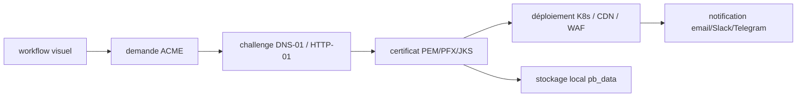

# certimate-go/certimate

> Gestionnaire de certificats SSL auto-hébergé : demande, déploiement, renouvellement, surveillance.

## Le problème
Renouveler des certificats ACME à la main sur des dizaines de domaines et les redéployer sur CDN, WAF et load balancers finit toujours par produire une expiration oubliée.

## Ce que ça fait vraiment
Orchestre un workflow visuel de bout en bout : demande du certificat, déploiement, renouvellement, notification.
Certificats simples, multiples, wildcard, adresses IP, clés RSA ou ECC, challenges DNS-01 et HTTP-01.
Plus de 70 registrars de domaines et plus de 160 destinations de déploiement (Kubernetes, CDN, WAF, load balancers).
Formats PEM, PFX, JKS ; CAs Let's Encrypt, Actalis, Google Trust Services, SSL.com, ZeroSSL.

## Comment c'est branché


## Essayer
```bash
docker run -d \
  --name certimate \
  --restart unless-stopped \
  -p 8090:8090 \
  -v $(pwd)/data:/app/pb_data \
  certimate/certimate:latest
```

## Coût et pièges
Gratuit, MIT. Le compte administrateur par défaut est `admin@certimate.fun` / `1234567890` : à changer immédiatement. Aucune base ni runtime à installer, ~20 Mo de mémoire annoncés.

## Ce que ce n'est pas
Pas un service géré : tu héberges, tu sauvegardes, tu réponds des incidents. Le README décline explicitement toute garantie, y compris en cas de perte de données ou d'interruption. Pas un remplaçant de cert-manager dans un cluster Kubernetes.

## Alternatives
Aucun projet concurrent nommé dans le README.

## Pour toi
Utile si tu as des certificats hors cluster à déployer sur des cibles hétérogènes ; sinon cert-manager suffit.
