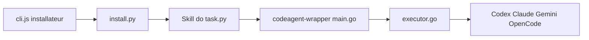

# cexll/myclaude

> Collection de workflows, commandes et skills pour Claude Code avec exécution multi-backends via un wrapper Go.

## Le problème
Organiser le développement assisté par IA (planification, revue, tests) demande de réécrire les mêmes commandes et agents pour chaque outil.

## Ce que ça fait vraiment
Un installateur `npx` dépose dans `~/.claude` des modules : `do` (développement en 5 phases, recommandé), `omo` (routage multi-agents), `bmad`, `requirements`, `essentials` (11 commandes), `sparv`, plus des skills (browser, codex, gemini…). Claude Code orchestre, le binaire `codeagent-wrapper` (Go) exécute les tâches via Codex, Claude, Gemini ou OpenCode, avec planification de tâches parallèles.

## Comment c'est branché


## Essayer
```bash
npx github:stellarlinkco/myclaude
npx github:stellarlinkco/myclaude --list
npx github:stellarlinkco/myclaude --update
```

## Coût et pièges
Il faut les CLI des backends installés et authentifiés : tokens à ta charge. L'installation écrase des fichiers de `~/.claude` (`--force`). Plusieurs familles de skills citées dans le README sont absentes de l'arbre analysé.

## Ce que ce n'est pas
Pas un agent en soi : c'est de la configuration et un wrapper. Licence AGPL-3.0, avec licence commerciale proposée par contact pour éviter ses obligations.

## Alternatives
Aucune alternative nommée dans le README.

## Pour toi
À surveiller : utile si tu veux un cadre de workflow multi-agents pour ton code, mais l'AGPL et l'installation dans ta configuration globale demandent de la prudence.

