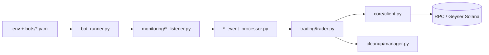

# chainstacklabs/pump-fun-bot

> Bot Python qui surveille les créations de tokens sur pump.fun et letsbonk.fun (Solana) et achète selon une stratégie configurée.

## Le problème
Repérer et acheter un token dès sa création exige d'écouter la chaîne en continu et de construire des transactions Solana à la main. Le dépôt sert aussi de support pédagogique sur ce flux.

## Ce que ça fait vraiment
Chaque fichier YAML de `bots/` définit une instance : un listener (geyser, logs, blocks ou pumpportal), une stratégie de sortie (`time_based`, `tp_sl`, `manual`) et des frais de priorité. Le mode `extreme_fast_mode` achète un montant fixe sans lire la courbe. `learning-examples/` contient des scripts autonomes (listeners, calcul de prix, achat/vente manuels, décodage).

## Comment c'est branché


## Essayer
```bash
uv sync
source .venv/bin/activate
uv pip install -e .
cp .env.example .env
pump_bot
uv run src/bot_runner.py
uv run learning-examples/verify_v2_account_layout.py
```

## Coût et pièges
Un nœud RPC/WSS privé est requis (les nœuds publics ne tiennent pas), plus une clé privée de portefeuille dans `.env`. Le README signale des bots d'arnaque dans les issues qui visent les clés privées, et les achats coûtent des frais même quand ils échouent.

## Ce que ce n'est pas
Ce n'est pas un outil de production : le README dit « NOT FOR PRODUCTION » et décline toute responsabilité. Il ne garantit aucun gain. Le listener `pumpportal` ne voit qu'un échantillon des créations.

## Alternatives
- pumpfun-cli (même éditeur) : interface terminal pour trader, lancer et gérer des tokens.
- pumpclaw : skill d'agent qui pilote pumpfun-cli.

## Pour toi
À ignorer : c'est un bot de trading de memecoins avec clé privée exposée, sans lien avec la data ou le MLOps ; seuls les scripts d'apprentissage Solana ont un intérêt ponctuel.

