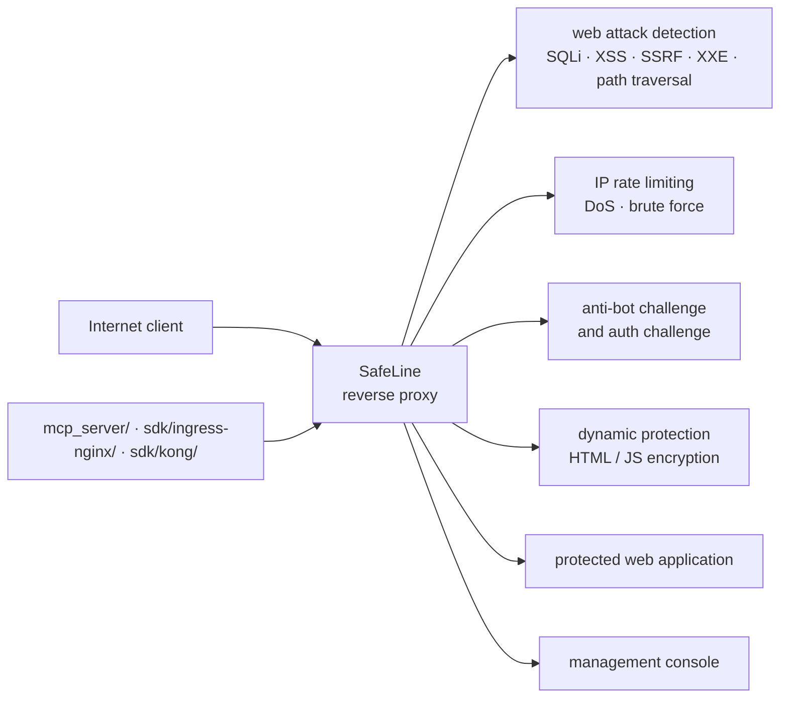

# chaitin/SafeLine

> **Self-hosted web application firewall, placed as a reverse proxy in front of an exposed app.**

## The problem

A web application facing the Internet takes SQL injections, XSS, path traversal, brute-force
attempts and scraping bots head-on. Fixing each hole in application code is slow, and the usual
filter is a hosted third-party service, which means your traffic passes through someone else's
infrastructure.

## What it actually does

SafeLine sits as a reverse proxy between the Internet and the application server and filters
HTTP/S traffic against a policy set. The README lists five capabilities: blocking web attacks
(SQL injection, XSS, code and OS command injection, CRLF, XXE, SSRF, path traversal), IP-based
rate limiting against denial of service and brute force, an anti-bot challenge that lets humans
through and blocks crawlers, an authentication challenge requiring a password before access, and
"dynamic protection" that encrypts the server's HTML and JS on every visit. A web access control
list and a management console complete the picture (screenshots in the README, plus a live demo).

The README publishes its own benchmark over 33,669 samples: 71.65% detection in balanced mode and
76.17% in strict mode, at 0.07% false positives — against ModSecurity level 1 (69.74% detection,
17.58% false positives) and CloudFlare Free (10.70%). Read it for what it is: a vendor-supplied
measurement.

## How it is wired

No code-derived diagram exists for this repository; the graph below is reconstructed from the
README alone, and its nodes are described functions rather than files in the repository.



## Trying it

The README contains **no installation commands**: it links out to the Install Guide and the
configuration page of the online documentation, and offers a hosted demo. There is nothing to
copy here, and nothing will be reconstructed.

```bash
# No command is documented in the README.
# Install: Install Guide -> docs.waf.chaitin.com/en/GetStarted/Deploy
# Configure: docs.waf.chaitin.com/en/GetStarted/AddApplication
# Demo: demo.waf.chaitin.com:9443
```

## Cost and gotchas

- **GPL-3.0 licence**: copyleft. Redistributing a modified version carries obligations; settle
  this before embedding it in a product.
- **Paid PRO edition**: the README advertises SafeLine PRO with a pricing page and a seven-day
  trial. The free edition is therefore a subset, and the README does not spell out where the
  line falls between free and PRO.
- **Cloud service dependency**: the README warns that users in mainland China installing the
  international edition may fail to reach the cloud services. Part of the product therefore lives
  outside the self-hosted machine.
- **Operating cost**: neither RAM, CPU and disk requirements nor the deployment method are
  quantified in the README. Both must be taken from the online documentation.
- **False positives**: 0.07% claimed in balanced mode, 0.22% in strict mode. On real traffic these
  are still legitimate requests being blocked, worth watching after rollout.

## What it is not

- **Not a library or an importable package**: it is a network component standing in front of the
  application, seeing and terminating traffic. You maintain it, patch it, and accept one more hop
  on the critical path.
- **Not a vulnerability scanner**: SafeLine filters inbound traffic; it audits neither code nor
  dependencies nor images. The flaws remain, they are merely harder to reach.
- **Not a network firewall or a CDN**: it acts at the HTTP/S application layer; content delivery,
  upstream IP filtering and volumetric DDoS absorption live elsewhere.

## Alternatives

| | When to pick it instead |
|---|---|
| **ModSecurity** (named in the README) | The long-standing WAF as a web server module, with no console and no paid tier. Pick it to stay inside nginx/Apache without adding a product; the README charges it with 17.58% false positives at level 1. |
| **CloudFlare** (named in the README) | Hosted filtering, nothing to operate yourself. Pick it when you would rather not run a machine; avoid it when traffic must not pass through a third party. |
| **azukaar/Cosmos-Server** (catalogue neighbour) | A self-hosted server bundling a reverse proxy and built-in protections. Pick it if the goal is to host everything as one block rather than add a dedicated WAF in front of what exists. |

The other neighbours (`anchore/grype`, `gravitl/netmaker`, `google/syzkaller`) are not comparable:
vulnerability scanning, mesh networking and kernel fuzzing.

## For you

Peripheral to data / AI / MLOps work, but useful the day an inference API, an annotation UI or an
internal dashboard is exposed to the Internet: this is the filter to put in front without handing
traffic to a third party. Watch it rather than adopt it by default — the GPL-3.0 copyleft, the
cloud service dependency and the PRO edition all need clearing before any enterprise rollout.
