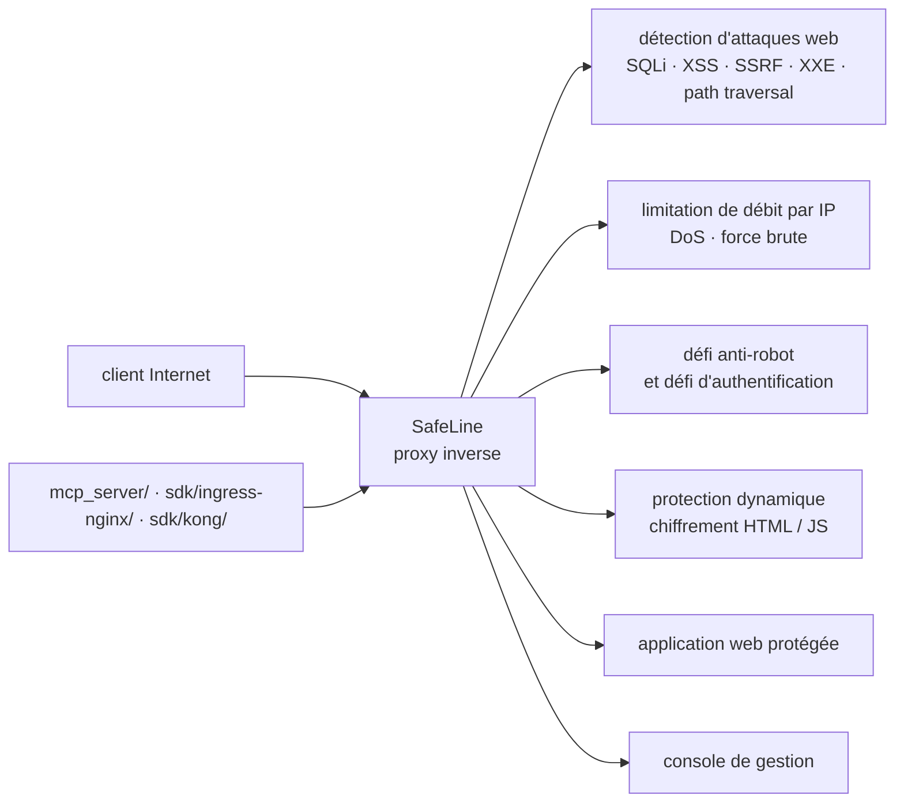

# chaitin/SafeLine

> **Pare-feu applicatif web auto-hébergé, posé en proxy inverse devant une application exposée.**

## Le problème

Une application web exposée encaisse directement les injections SQL, les XSS, les traversées de
chemin, les tentatives de force brute et les robots d'aspiration ; corriger chaque faille dans le
code applicatif est lent, et le seul filtre disponible est souvent un service tiers hébergé chez
un fournisseur, avec le trafic qui transite chez lui.

## Ce que ça fait vraiment

SafeLine se place en proxy inverse entre Internet et le serveur d'application, et filtre le
trafic HTTP/S selon un jeu de politiques. Le README annonce cinq capacités : blocage des attaques
web (injection SQL, XSS, injection de code ou de commandes système, CRLF, XXE, SSRF, traversée de
chemin), limitation de débit par IP contre le déni de service et la force brute, défi anti-robot
qui laisse passer les humains et bloque les crawlers, défi d'authentification par mot de passe
avant accès, et « protection dynamique » qui chiffre le HTML et le JS du serveur à chaque visite.
S'y ajoutent une liste de contrôle d'accès web et une interface de gestion (captures d'écran dans
le README, démonstration en ligne).

Le README publie sa propre mesure comparative sur 33 669 échantillons : détection 71,65 % en
mode équilibré et 76,17 % en mode strict, pour 0,07 % de faux positifs — face à ModSecurity
niveau 1 (69,74 % de détection, 17,58 % de faux positifs) et CloudFlare gratuit (10,70 %). Chiffre
à lire comme ce qu'il est : un banc d'essai fourni par l'éditeur.

## Comment c'est branché

Aucun diagramme tiré du code n'existe pour ce dépôt ; le schéma ci-dessous est reconstruit depuis
le seul README, et ses nœuds sont des fonctions décrites, pas des fichiers du dépôt.



## Essayer

Le README ne donne **aucune commande d'installation** : il renvoie au guide d'installation et à
la page de configuration de la documentation en ligne, et propose une démonstration hébergée. Il
n'y a donc rien à copier ici, et rien ne sera reconstruit.

```bash
# Aucune commande n'est documentée dans le README.
# Installation : Install Guide -> docs.waf.chaitin.com/en/GetStarted/Deploy
# Configuration : docs.waf.chaitin.com/en/GetStarted/AddApplication
# Démonstration : demo.waf.chaitin.com:9443
```

## Coût et pièges

- **Licence GPL-3.0** : copyleft. Toute redistribution d'une version modifiée entraîne des
  obligations ; à trancher avant intégration dans un produit.
- **Édition PRO payante** : le README annonce SafeLine PRO avec une grille tarifaire et un essai
  de sept jours. La version libre est donc un sous-ensemble, dont le README ne détaille pas les
  limites — le partage exact des fonctions entre gratuit et PRO n'est pas documenté ici.
- **Dépendance à un service cloud** : le README avertit que les utilisateurs de Chine
  continentale installant la version internationale peuvent ne pas réussir à joindre les services
  cloud. Une partie du produit sort donc de la machine auto-hébergée.
- **Coût d'exploitation** : ni les besoins en RAM, CPU ou disque, ni la méthode de déploiement
  ne sont chiffrés dans le README. À établir depuis la documentation en ligne.
- **Faux positifs** : 0,07 % annoncés en mode équilibré, 0,22 % en mode strict. Sur un trafic
  réel, cela reste des requêtes légitimes bloquées, à surveiller après mise en service.

## Ce que ce n'est pas

- **Ce n'est pas une bibliothèque ni un paquet à importer** : c'est un composant réseau posé
  devant l'application, qui voit et déchiffre le trafic. Il faut le maintenir, le mettre à jour
  et accepter un point de passage supplémentaire sur le chemin critique.
- **Ce n'est pas un scanner de vulnérabilités** : SafeLine filtre le trafic entrant, il n'audite
  ni le code, ni les dépendances, ni les images. Les failles restent présentes, simplement moins
  atteignables.
- **Ce n'est pas un pare-feu réseau ni un CDN** : il agit au niveau HTTP/S applicatif ; la
  distribution de contenu, le filtrage IP en amont et l'anti-DDoS volumétrique sont ailleurs.

## Alternatives

| | Quand le préférer |
|---|---|
| **ModSecurity** (nommé dans le README) | Le WAF historique en module de serveur web, sans console ni édition payante. À préférer quand on veut rester dans nginx/Apache sans ajouter un produit ; le README lui reproche 17,58 % de faux positifs au niveau 1. |
| **CloudFlare** (nommé dans le README) | Filtrage hébergé, rien à exploiter soi-même. À préférer quand on ne veut pas administrer de machine ; à écarter si le trafic ne doit pas transiter par un tiers. |
| **azukaar/Cosmos-Server** (voisin du catalogue) | Serveur auto-hébergé incluant proxy inverse et protections intégrées. À préférer si le besoin est de tout héberger d'un bloc plutôt que d'ajouter un WAF spécialisé devant l'existant. |

Les autres voisins (`anchore/grype`, `gravitl/netmaker`, `google/syzkaller`) ne sont pas
comparables : analyse de vulnérabilités, réseau maillé et fuzzing de noyau.

## Pour toi

Périphérique au métier data / IA / MLOps, mais utile le jour où une API d'inférence, une interface
d'annotation ou un tableau de bord interne est exposé sur Internet : c'est le filtre à poser devant,
sans confier le trafic à un tiers. À surveiller plutôt qu'à adopter par défaut — le copyleft GPL-3.0,
le lien avec un service cloud et l'édition PRO sont à lever avant tout déploiement d'entreprise.
