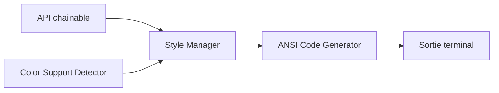

# chalk/chalk

> Bibliothèque Node.js de style de chaînes pour le terminal (couleurs, gras, soulignement).

## Le problème
Écrire des codes ANSI à la main est illisible et ne gère pas les terminaux sans couleurs.

## Ce que ça fait vraiment
API chaînable (`chalk.blue.bgRed.bold('…')`) avec imbrication de styles, couleurs 16, 256 et vraies couleurs (RGB, hex), détection automatique du support (niveaux 0 à 3) et thèmes personnalisés. Sans dépendances, n'étend pas `String.prototype`. Chalk 5 est en ESM uniquement : le README conseille Chalk 4 pour TypeScript ou certains outils de build.

## Comment c'est branché


## Essayer
```bash
npm install chalk
```
```js
import chalk from 'chalk';
console.log(chalk.blue('Hello world!'));
```

## Coût et pièges
Gratuit. ESM uniquement depuis Chalk 5. Modifier `chalk.level` est global.

## Ce que ce n'est pas
Ce n'est pas un framework d'interface terminal, seulement de la coloration.

## Alternatives
- yoctocolors : plus petit, du même auteur, cité par le README.

## Pour toi
Surveiller : pertinent seulement si tu écris des outils en Node ; en Python, l'équivalent est une autre bibliothèque.

