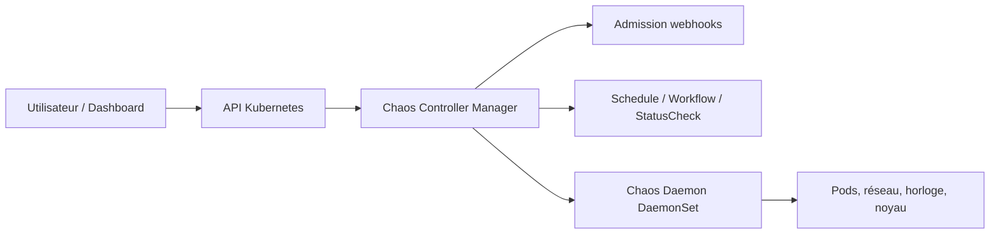

# chaos-mesh/chaos-mesh

> Plateforme de chaos engineering pour Kubernetes, pilotée par ressources personnalisées.

## Le problème
On ne sait pas si un système résiste à la panne tant qu'on ne l'a pas provoquée, et injecter une
faute réseau ou horloge sans casser les voisins sur le même nœud est délicat.

## Ce que ça fait vraiment
Les expériences de chaos sont des CRD : elles se définissent, s'orchestrent et s'observent par
l'API Kubernetes standard, avec le RBAC habituel. Couverture large des fautes — pod, réseau, DNS,
HTTP, E/S, temps, stress, noyau, périphérique bloc, JVM, machine physique, AWS, Azure, GCP. Les
ressources `Schedule`, `Workflow` et `StatusCheck` permettent les expériences récurrentes, les
enchaînements série ou parallèle et les contrôles de santé applicative. Exécution multi-cluster
depuis un cluster de gestion.

## Comment c'est branché


## Essayer
```bash
# Aucune commande documentée dans le README : il renvoie à l'installation par Helm,
# au guide « Run a Chaos experiment » et au playground Killercoda en navigateur.
```

## Coût et pièges
Gratuit, projet en incubation CNCF, marque déposée Linux Foundation. Le Chaos Daemon tourne en
DaemonSet et effectue des opérations **privilégiées** au niveau nœud et conteneur : c'est une
surface d'attaque à cadrer. Le Dashboard est optionnel si tout passe par l'API.

## Ce que ce n'est pas
Ce n'est pas un outil de test de charge ni de monitoring. Ce n'est pas utilisable hors
Kubernetes, sauf pour les fautes « machine physique ». Casser volontairement la production
sans plan de reprise reste une mauvaise idée que l'outil ne protège pas.

## Alternatives
Aucune alternative nommée dans le README.

## Pour toi
Pertinent seulement si tu exploites un cluster de production ; hors scope d'un travail data pur.
