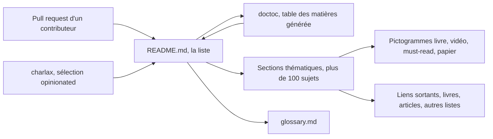

# charlax/professional-programming

> **A hand-curated reading list** for developers who want to improve without reading at random.

## The problem

Material about the craft of software engineering is endless and wildly uneven in quality;
without a filter you read a lot and retain little. The README states the goal plainly: to
make you a more proficient developer, keeping only what the author found genuinely
inspiring or what has become a timeless classic.

## What it actually does

It is a single page: a README of roughly 177,000 characters with a doctoc-generated table
of contents, listing books, articles, videos, slide decks and papers. The content is split
into three blocks: "Must-read books", "Must-read articles", then more than a hundred
thematic sections (algorithms, API design, code reviews, databases, debugging, Docker,
Kubernetes, LLM, machine learning, observability, security, SRE, system architecture,
career growth, engineering management and so on), plus a "Concepts" section pointing to a
`glossary.md`. Each entry is tagged with a pictogram: 🧰 list of resources, 📖 book,
🎞 video, 🏙 slides, ⭐️ must-read, 📃 paper. Many lines carry a one-sentence comment from
the author. The repository ships no runnable code and no tool: it does nothing beyond
pointing outward.

## How it is wired



There is no software architecture here: the central piece is the README itself.
Contributions arrive as pull requests, and the README says openly that not everything gets
merged, since keeping the list concise is a stated criterion. The table of contents is
regenerated by doctoc, with HTML comments asking readers not to edit it by hand. Everything
else is an outbound link: paid books, blog posts, and other GitHub lists.

## Trying it

```
# No command is documented in the README: this repo is read, not installed.
# Open the page on GitHub and follow the table of contents;
# glossary.md complements the Concepts section.
```

## Cost and traps

Nothing to install, nothing to pay for the repository itself. The real cost is elsewhere:
several "must-read books" link to Amazon or the publisher and are paid titles (the README
separately flags the few free ones, including SICP and `free-programming-books`). Second
trap: sheer volume. The table of contents lists over a hundred sections; without a precise
reading goal, it is a list you get lost in. Third trap: link rot — a list this large
inevitably accumulates dead links and dated articles, and the README documents no
verification process.

## What it is not

It is not a Python library: the language GitHub reports comes at best from side scripts,
not from an importable API. It is not a structured course or a progressive curriculum — it
is a bibliography, and the reading order is yours to decide. It is not exhaustive or
neutral either: the README says so itself, the selection is deliberately incomplete and
opinionated, and the author notes he does not endorse every line of every resource listed.

## Alternatives

Named in the README: `EbookFoundation/free-programming-books` and
`vhf/free-programming-books` if you want volume and free material rather than a curated
selection; `jwasham/coding-interview-university` for a structured, interview-oriented study
plan, where this list offers no path at all; `liuchong/awesome-roadmaps` for roadmaps rather
than a bibliography. The author's other lists (`charlax/python-education`,
`charlax/engineering-management`) cover a narrower scope.

## For you

Useful as an entry point when you want to step outside pure data work: the observability,
reliability, system architecture, releasing and code review sections are exactly what a
data/MLOps profile coming from modelling tends to lack. The machine learning, LLM and
agentic coding sections exist, but they are one shelf among a hundred, not the reason to
come here.
