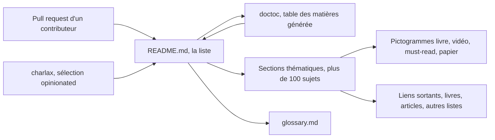

# charlax/professional-programming

> **Une bibliographie triée à la main** pour développeurs qui veulent progresser sans lire au hasard.

## Le problème

Les ressources sur le métier de développeur sont innombrables et de qualité très inégale ;
sans filtre, on lit beaucoup et on retient peu. Le README pose explicitement l'objectif :
« make you a more proficient developer », en ne gardant que ce que l'auteur a trouvé
inspirant ou devenu un classique.

## Ce que ça fait vraiment

C'est une page unique : un README de ~177 000 caractères, avec une table des matières
générée par doctoc, qui liste des livres, articles, vidéos, slides et papiers.
Le contenu est organisé en trois blocs : « Must-read books », « Must-read articles », puis
plus d'une centaine de sections thématiques (algorithmes, API design, code review, bases de
données, debugging, Docker, Kubernetes, LLM, machine learning, observabilité, sécurité, SRE,
system architecture, carrière, management…), plus une section « Concepts » renvoyant à un
`glossary.md`. Chaque entrée est annotée par un pictogramme : 🧰 liste de ressources,
📖 livre, 🎞 vidéo, 🏙 slides, ⭐️ must-read, 📃 papier. Beaucoup de lignes portent en plus
une phrase de commentaire de l'auteur. Le dépôt ne fournit aucun code exécutable ni aucun
outil : il ne « fait » rien d'autre que pointer vers l'extérieur.

## Comment c'est branché



Il n'y a pas d'architecture logicielle : la « pièce centrale » est le README lui-même.
Les contributions arrivent par pull request — le README précise que tout n'est pas accepté,
la concision étant un critère revendiqué. La table des matières est régénérée par doctoc,
les commentaires HTML du fichier demandant de ne pas l'éditer à la main. Tout le reste est
du lien sortant : livres payants, articles de blog, et d'autres listes GitHub.

## Essayer

```
# Aucune commande n'est documentée dans le README : le dépôt se lit,
# il ne s'installe pas. On ouvre la page sur GitHub et on suit la
# table des matières ; glossary.md complète la section Concepts.
```

## Coût et pièges

Rien à installer, rien à payer pour le dépôt lui-même. Le coût réel est ailleurs : une
partie des « must-read books » renvoie vers Amazon ou l'éditeur et sont des livres payants
(le README signale à part les quelques ressources gratuites, dont SICP et
`free-programming-books`). Deuxième piège : le volume. La table des matières compte plus de
cent sections ; sans objectif de lecture précis, c'est une liste où l'on se perd. Troisième
piège : la fraîcheur des liens sortants — une liste de cette taille accumule mécaniquement
des liens morts ou des articles datés, et le README ne documente aucun processus de
vérification.

## Ce que ce n'est pas

Ce n'est pas une bibliothèque Python : le langage annoncé par GitHub vient au mieux de
scripts annexes, pas d'une API à importer. Ce n'est pas un cours structuré ni un parcours
progressif — c'est une bibliographie, l'ordre de lecture est à votre charge. Ce n'est pas
non plus une liste exhaustive ni neutre : le README le dit lui-même, elle est délibérément
incomplète, « opinionated », et l'auteur précise qu'il n'endosse pas chaque ligne de chaque
ressource citée.

## Alternatives

Nommés dans le README : `EbookFoundation/free-programming-books` et
`vhf/free-programming-books` si l'on cherche du volume et du gratuit plutôt qu'une
sélection ; `jwasham/coding-interview-university` pour un plan d'étude structuré orienté
entretien, là où cette liste ne propose aucun parcours ; `liuchong/awesome-roadmaps` pour
des feuilles de route plutôt qu'une bibliographie. Les autres listes du même auteur
(`charlax/python-education`, `charlax/engineering-management`) couvrent un périmètre plus
étroit.

## Pour toi

Utile comme point d'entrée quand on veut sortir du seul périmètre data : les sections
observabilité, reliability, system architecture, releasing et code review sont exactement
ce qui manque à un profil data/MLOps venu de la modélisation. Les sections machine learning,
LLM et agentic coding existent mais sont un rayon parmi cent, pas la raison d'y venir.
