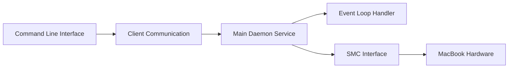

# charlie0129/batt

> Outil pour limiter la charge de la batterie des MacBook Apple Silicon, en ligne de commande ou menu.

## Le problème
Garder un MacBook à 100 % branché use la batterie ; l'option système « charge optimisée » suit un horaire imprévisible.

## Ce que ça fait vraiment
Un démon (Go, avec du C pour IOKit et le SMC) contrôle la charge ; un client CLI ou une application de barre de menus lui parle par socket Unix. Il fixe un plafond (60 % par défaut), coupe l'adaptateur, pilote la LED MagSafe, calibre la batterie. Le README note que macOS 26.4+ sait limiter la charge nativement (80–100 %) : `batt` reste utile en dessous de 80 %. Nécessite les droits root, sans télémétrie selon l'auteur.

## Comment c'est branché


## Essayer
```bash
brew install batt
sudo brew services start batt
sudo batt status
sudo batt limit 80
```

## Coût et pièges
Gratuit ; root obligatoire (écriture SMC). Apple Silicon seulement. Compatibilité liée au firmware, non à la version de macOS ; les bêtas de macOS 27 sont partiellement non supportées.

## Ce que ce n'est pas
Pas un outil pour Mac Intel. Ne fonctionne pas macOS éteint.

## Alternatives
Aucune alternative nommée dans le README (BattGUI et batt-helper sont des interfaces bâties autour de `batt`).

## Pour toi
À ignorer : utilitaire personnel de laptop sans lien avec la donnée ou l'IA, sauf envie de protéger ta batterie.

