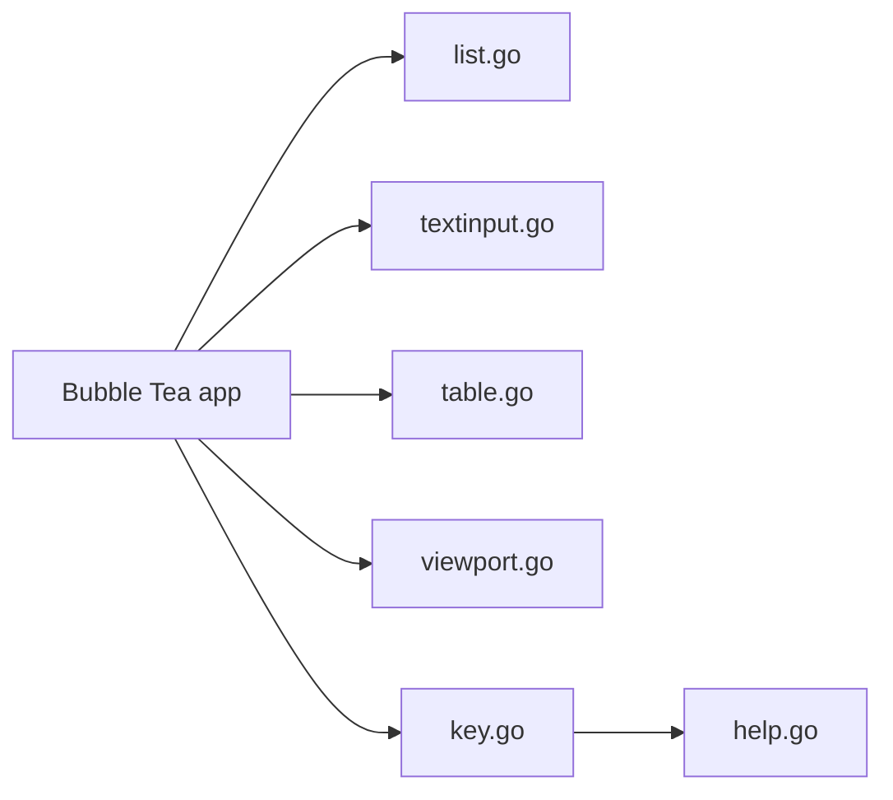

# charmbracelet/bubbles

> Composants d'interface pour terminal en Go, à utiliser avec Bubble Tea.

## Le problème
Construire des interfaces terminal (saisie, listes, tables) à partir de zéro est long.

## Ce que ça fait vraiment
Composants prêts à brancher : spinner, saisie de texte, zone de texte, table, barre de progression, pagination, viewport, liste (filtrage flou, aide auto), sélecteur de fichier, minuteur, chronomètre, aide, gestion de raccourcis (`key`). Utilisés dans Crush. Le code montre aussi un composant arbre.

## Comment c'est branché


## Essayer
Le README ne donne pas de commande d'installation ; il montre un exemple de gestion de touches :
```go
key.NewBinding(key.WithKeys("k", "up"), key.WithHelp("↑/k", "move up"))
```

## Coût et pièges
Gratuit. Guide de migration depuis la v1 mentionné. 235 issues ouvertes.

## Ce que ce n'est pas
Pas un framework autonome : sans Bubble Tea, rien ne tourne. Pas de commande d'installation dans le README.

## Alternatives
Aucune nommée (composants communautaires : charm-and-friends/additional-bubbles).

## Pour toi
À surveiller : utile si tu écris des CLI Go interactives pour tes outils MLOps ; sans objet en Python.

