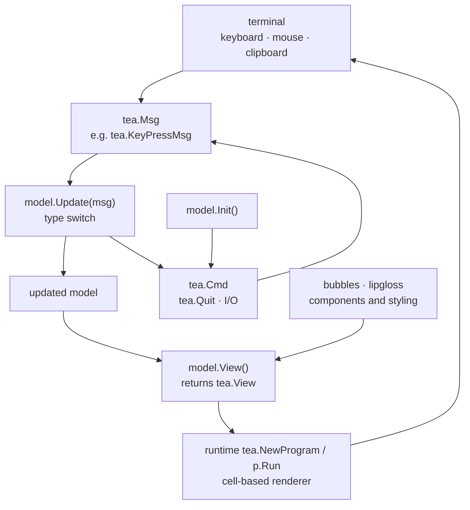

# charmbracelet/bubbletea

> **A Go framework for stateful terminal apps, built on an Init / Update / View model.**

## The problem

Writing an interactive terminal program by hand means handling key reading, mouse input,
partial screen redraws, terminal colour capabilities and alt-screen mode yourself — plumbing
that has nothing to do with the application and that breaks on the next emulator.

## What it actually does

Bubble Tea imposes a structure taken from The Elm Architecture: a `model` holding state, an
`Init` method returning an initial `Cmd`, an `Update` method that receives a `Msg` (keypress,
timer tick, server response) and returns the updated model, and a `View` method that builds a
`tea.View`. You never redraw anything yourself.

The engine is `tea.NewProgram(model)` then `p.Run()`. On the runtime side the README lists a
cell-based renderer, built-in colour downsampling, declarative views, keyboard and mouse
handling, and clipboard support. The `View` also declares terminal features: alt screen,
mouse tracking, cursor position.

Apps can be inline, full-window, or a mix. A `tea.LogToFile("debug.log", "debug")` helper is
provided, because stdout is taken by the UI. The README flags a v2 and points to
`UPGRADE_GUIDE_V2.md`: the import path is now `charm.land/bubbletea/v2`.

## How it is wired

No code-derived diagram exists for this repo: the graph below is reconstructed from the
README alone, from the type and function names it cites.



## Trying it

The README documents no install command: it gives a Go tutorial whose import is
`tea "charm.land/bubbletea/v2"` and notes in a comment that you may need to
`run go mod tidy` to download bubbletea and its dependencies. The only literal commands in
the README are about debugging and logs:

```bash
# Start the debugger
$ dlv debug --headless --api-version=2 --listen=127.0.0.1:43000 .
API server listening at: 127.0.0.1:43000

# Connect to it from another terminal
$ dlv connect 127.0.0.1:43000
```

```bash
tail -f debug.log
```

## Cost and gotchas

- **Free, MIT, nothing to install service-side**: no API key, no account, no GPU, no SaaS.
  The cost is the time spent writing Go.
- **You need working Go knowledge**: the README says so outright. This is not a declarative
  UI generator.
- **v1 → v2 break**: the import path changed (`charm.land/bubbletea/v2`) and `View` now
  returns a `tea.View` rather than a string. A migration guide exists, but every v1 example
  found online has to be translated.
- **Debugging is constrained**: the program owns stdin and stdout, so no `fmt.Println`,
  headless delve required, logs to a file.
- **Components are not included**: text inputs, lists and spinners come from `bubbles`,
  styling from `lipgloss` — separate dependencies.

## What it is not

- **Not a component library.** Bubble Tea provides no button, menu or text field: it provides
  the event loop and the renderer. Widgets live in `charmbracelet/bubbles`, layout and style
  in `charmbracelet/lipgloss`.
- **Not a command-line tool**: there is nothing to launch or install; it is a Go module you
  import to write your own binary.
- **Not a multi-language framework**: Go only, and the Elm architecture is mandatory — global
  mutable state does not fit without a rewrite.

## Alternatives

| | When to prefer it |
|---|---|
| **charmbracelet/bubbles** | Named in the README: a companion, not a competitor. Add it as soon as you want a text input, list or spinner rather than writing them. |
| **charmbracelet/lipgloss** | Named in the README: styling, colour and layout for terminal text. Prefer it alone when the program prints nicely but is not interactive — no event loop needed. |
| **charmbracelet/glamour** | From the same Charm ecosystem: Markdown rendering in the terminal. Prefer it when the need is displaying a document, not driving a stateful app. |

The neighbour `ankitpokhrel/jira-cli` is not an alternative: it is an application, the kind
of thing you build with Bubble Tea.

## For you

Adopt it as soon as an internal tool deserves better than a script full of `print`: training
dashboards, job monitors, experiment pickers, configuration wizards. The trade-off is clear —
it is Go, therefore outside the usual Python chain: good for tooling a team, not for
instrumenting a notebook.
