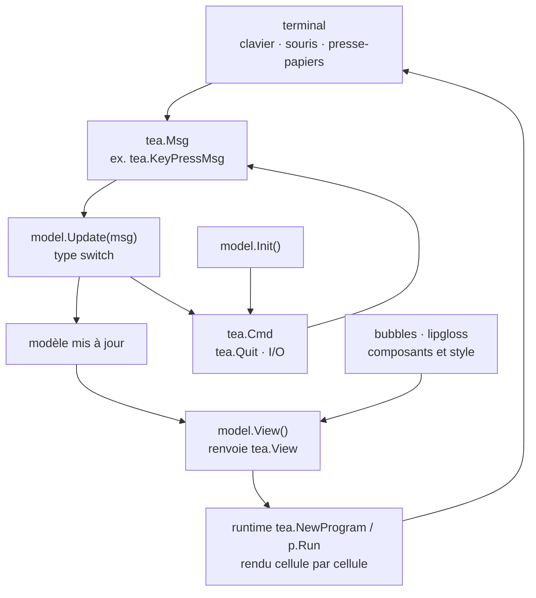

# charmbracelet/bubbletea

> **Cadre Go pour écrire des interfaces de terminal à état, sur le modèle Init / Update / View.**

## Le problème

Écrire un programme de terminal interactif à la main veut dire gérer soi-même la lecture des
touches, la souris, le redessin partiel de l'écran, les capacités de couleur du terminal et
le mode plein écran — du code de plomberie qui n'a rien à voir avec l'application, et qui se
casse dès qu'on change d'émulateur.

## Ce que ça fait vraiment

Bubble Tea impose une structure inspirée de l'architecture Elm : un `model` qui porte l'état,
une méthode `Init` qui renvoie une `Cmd` initiale, une méthode `Update` qui reçoit des `Msg`
(frappe clavier, tic d'horloge, réponse serveur) et renvoie le modèle mis à jour, et une
méthode `View` qui construit une `tea.View`. On ne redessine jamais soi-même.

Le moteur, c'est `tea.NewProgram(model)` puis `p.Run()`. Le README annonce, côté runtime, un
rendu cellule par cellule, le sous-échantillonnage automatique des couleurs, des vues
déclaratives, la gestion du clavier et de la souris, et l'accès au presse-papiers. La `View`
déclare aussi les options de terminal : écran alternatif, suivi souris, position du curseur.

Les applications peuvent être en ligne, plein écran, ou un mélange des deux. Un utilitaire
`tea.LogToFile("debug.log", "debug")` est fourni, parce que la sortie standard est occupée
par l'interface. Le README signale une v2 et renvoie à `UPGRADE_GUIDE_V2.md` : le chemin
d'import est désormais `charm.land/bubbletea/v2`.

## Comment c'est branché

Aucun diagramme tiré du code n'existe pour ce dépôt : ce schéma est reconstruit depuis le
seul README, d'après les noms de types et de fonctions qu'il cite.



## Essayer

Le README ne documente pas de commande d'installation : il donne un tutoriel en Go dont
l'import est `tea "charm.land/bubbletea/v2"` et mentionne en commentaire qu'il faut
« run `go mod tidy` to download bubbletea and its dependencies ». Les seules commandes
littérales du README concernent le débogage et les journaux :

```bash
# Start the debugger
$ dlv debug --headless --api-version=2 --listen=127.0.0.1:43000 .
API server listening at: 127.0.0.1:43000

# Connect to it from another terminal
$ dlv connect 127.0.0.1:43000
```

```bash
tail -f debug.log
```

## Coût et pièges

- **Gratuit, MIT, rien à installer côté service** : pas de clé d'API, pas de compte, pas de
  GPU, pas de SaaS. Le coût est en temps d'écriture de code Go.
- **Il faut savoir écrire du Go** : le README le dit (« assumes you have a working knowledge
  of Go »). Ce n'est pas un générateur d'interface déclaratif.
- **Rupture v1 → v2** : le chemin d'import a changé (`charm.land/bubbletea/v2`) et la `View`
  renvoie désormais un `tea.View` et non une chaîne. Un guide de migration existe, mais tout
  exemple v1 trouvé en ligne est à retraduire.
- **Le débogage est contraint** : le programme prend le contrôle de stdin et stdout, donc pas
  de `fmt.Println`, delve en mode headless obligatoire, journaux dans un fichier.
- **Les composants ne sont pas inclus** : champs de saisie, listes, spinners viennent de
  `bubbles`, le style de `lipgloss` — dépendances séparées à ajouter.

## Ce que ce n'est pas

- **Ce n'est pas une bibliothèque de composants.** Bubble Tea ne fournit ni bouton, ni menu,
  ni champ texte : il fournit la boucle d'événements et le rendu. Les widgets sont dans
  `charmbracelet/bubbles`, la mise en forme dans `charmbracelet/lipgloss`.
- **Ce n'est pas un outil en ligne de commande** : rien à lancer, rien à installer ; c'est un
  module Go qu'on importe pour écrire son propre binaire.
- **Ce n'est pas un cadre multi-langages** : Go uniquement, et l'architecture Elm est imposée
  — un état global muté depuis partout n'y rentre pas sans réécriture.

## Alternatives

| | Quand le préférer |
|---|---|
| **charmbracelet/bubbles** | Nommée dans le README : complément, pas concurrent. À prendre en plus dès qu'on veut un champ de saisie, une liste ou un spinner plutôt que de les écrire. |
| **charmbracelet/lipgloss** | Nommée dans le README : style, couleurs et mise en page du texte de terminal. À préférer seule si le programme affiche joliment mais n'est pas interactif — pas besoin de boucle d'événements. |
| **charmbracelet/glamour** | Nommée indirectement via l'écosystème Charm : rendu de Markdown en terminal. À préférer si le besoin est d'afficher un document, pas de piloter une application à état. |

Le voisin `ankitpokhrel/jira-cli` n'est pas une alternative : c'est une application, du genre
de celles qu'on construit avec Bubble Tea.

## Pour toi

À adopter dès qu'un outil interne mérite mieux qu'un script à `print` : tableaux de bord
d'entraînement, suivi de jobs, sélecteurs d'expériences, assistants de configuration. La
contrepartie est nette — c'est du Go, donc hors de la chaîne Python habituelle : pertinent
pour outiller une équipe, pas pour instrumenter un notebook.
