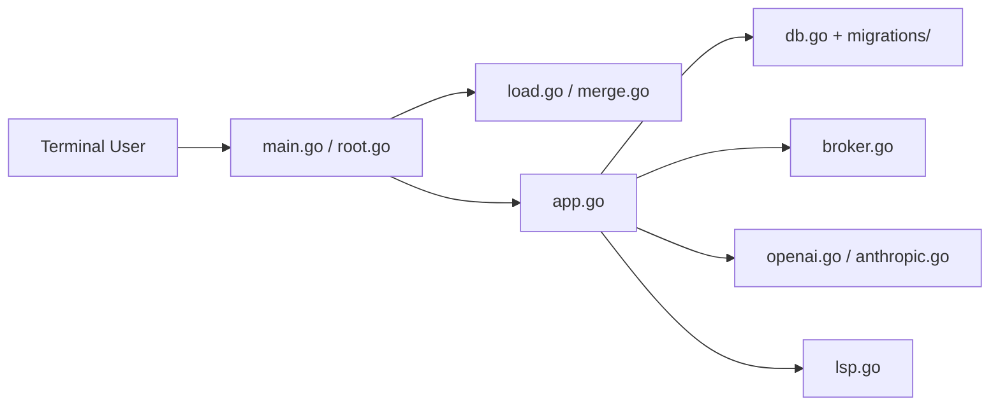

# charmbracelet/crush

> Agent de code en terminal (Go), multi-fournisseurs LLM, avec LSP, MCP et skills.

## Le problème
Les agents de code terminal sont souvent liés à un seul fournisseur ; changer de modèle en cours de session ou brancher un modèle local est laborieux.

## Ce que ça fait vraiment
TUI Go : sessions multiples par projet, changement de modèle en cours de session, contexte enrichi par LSP.
Fournisseurs : Anthropic, OpenAI, Gemini, Bedrock, Vertex, OpenRouter, Ollama, llama.cpp… (catalogue Catwalk).
Config en `crushrc` (Bash interprété), MCP stdio/http/sse avec OAuth, Agent Skills, hooks, permissions d'outils.
État en SQLite, logs dans `.crush/logs`, mode serveur partagé (`crush serve`).

## Comment c'est branché


## Essayer
```bash
brew install charmbracelet/tap/crush
npm install -g @charmland/crush
go install github.com/charmbracelet/crush@latest
crush logs --follow
```

## Coût et pièges
Clé d'API à ta charge (ou modèle local), ou abonnement Hyper. `crushrc` exécute du shell : ne pas lancer dans un dossier non relu. Métriques pseudonymes activées par défaut (`CRUSH_DISABLE_METRICS=1`).

## Ce que ce n'est pas
Pas un IDE. Bedrock sans cache. Le mode `--yolo` supprime toute confirmation.

## Alternatives
Aucune alternative nommée dans le README.

## Pour toi
Surveiller : intéressant pour tester des modèles locaux (Ollama) dans un agent terminal, mais ton flux Claude Code couvre déjà l'essentiel ; télémétrie et licence à vérifier.
