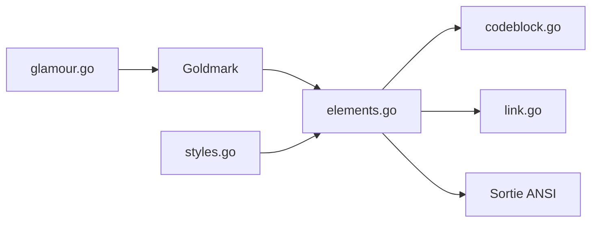

# charmbracelet/glamour

> Rendu Markdown stylé en ANSI dans le terminal pour applications Go, avec feuilles de style.

## Le problème
Afficher du Markdown lisible dans un terminal exige de gérer couleurs, retours à la ligne et blocs de code.

## Ce que ça fait vraiment
Analyse le Markdown avec Goldmark, associe chaque nœud à un élément ANSI, applique un style intégré ou fichier. Coloration syntaxique des blocs de code, liens et pieds de liens de tableaux, emoji. Le rendu est « pur » : aucune réduction de couleurs, à faire avec Lip Gloss.

## Comment c'est branché


## Essayer
```go
import "charm.land/glamour/v2"

out, err := glamour.Render(in, "dark")
fmt.Print(out)
```

## Coût et pièges
Gratuit. Variable `GLAMOUR_STYLE` pour imposer un style. 161 issues ouvertes.

## Ce que ce n'est pas
Pas un visualiseur en soi : pour cela, le README renvoie vers Glow.

## Alternatives
Glow (outil de rendu en ligne de commande) construit sur glamour.

## Pour toi
Utile pour un CLI Go d'agent ou de MLOps qui affiche des réponses Markdown ; sinon sans objet : adopter dans ce cas.

