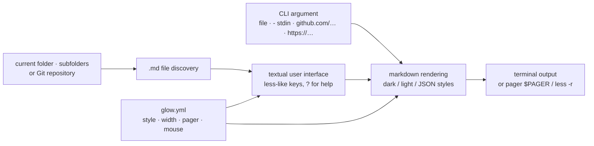

# charmbracelet/glow

> **A terminal markdown reader that discovers files in the current folder or Git repo and renders them.**

## The problem

Reading a README or a documentation note without leaving the terminal leaves you choosing
between `cat`, which shows raw syntax, and an editor or a browser, which breaks the flow of
work. And when you no longer remember where the markdown file you want sits in a tree, you
have to find it before you can even open it.

## What it actually does

Glow is a single Go binary doing two things. Started with no argument, it opens a textual
user interface: it **discovers** markdown files in the current directory and below or, if you
are inside a Git repository, searches the repo, then shows them in its pager — the `less`
keystrokes work there, and `?` lists the hotkeys.

Started with an argument, it behaves as a formatting command: a file path, `-` for standard
input, a `github.com/owner/repo` or `gitlab.com/...` address whose README it fetches, or an
HTTP URL to a `.md` file. The documented settings are the word-wrap width (`-w`), routing
through a pager (`-p`, falling back to `less -r` when `$PAGER` is unset), and the style
(`-s dark`, `-s light`, or a JSON stylesheet; with no flag, Glow tries to detect the
terminal's background colour). The same options can be frozen into a `glow.yml` opened by
`glow config`: `style`, `mouse`, `pager`, `width`, `all`, `showLineNumbers`,
`preserveNewLines`.

## How it is wired



No code-derived diagram exists for this repository: this graph is rebuilt from the README
alone, so it names roles rather than source files. The README does not describe the internal
layout of the code; it does state that the styles come from the Glamour project, the rendering
engine of the Charm family.

## Try it

```bash
# macOS or Linux
brew install glow
```

```bash
# Debian/Ubuntu
sudo mkdir -p /etc/apt/keyrings
curl -fsSL https://repo.charm.sh/apt/gpg.key | sudo gpg --dearmor -o /etc/apt/keyrings/charm.gpg
echo "deb [signed-by=/etc/apt/keyrings/charm.gpg] https://repo.charm.sh/apt/ * *" | sudo tee /etc/apt/sources.list.d/charm.list
sudo apt update && sudo apt install glow
```

```bash
go install charm.land/glow/v3@latest
```

Then:

```bash
# Read from file
glow README.md

# Read from stdin
echo "[Glow](https://github.com/charmbracelet/glow)" | glow -

# Fetch README from GitHub / GitLab
glow github.com/charmbracelet/glow

# Fetch markdown from HTTP
glow https://host.tld/file.md
```

```bash
glow -w 60
glow -s [dark|light]
glow -s mystyle.json
glow --help
```

To build from source (Go 1.21+ per the README):

```bash
git clone https://github.com/charmbracelet/glow.git
cd glow
go build
```

## Cost and pitfalls

- **Free, no account and no key.** The repository is MIT and the binary runs locally.
- **Network as soon as you go past a local file**: `glow github.com/...` and
  `glow https://...` fetch the document remotely. The Debian and RPM packages go through
  `repo.charm.sh`, the vendor's own infrastructure, with its GPG key to add to the system
  keyrings. That is the reason for the alert: nothing is billed, but the recommended install
  on those distributions adds a third-party repository. `brew`, `pacman`, `winget`, the
  binaries from the releases page or `go install` avoid it.
- **Colour rendering depends on the terminal**: without `-s`, Glow tries to detect the
  background colour; if detection guesses wrong the text can be unreadable and you must force
  `-s dark` or `-s light`. The README also notes that mouse wheel support (`mouse`) and line
  numbers (`showLineNumbers`) are TUI-mode only.
- **The config file path is not spelled out**: the README points to `glow --help` to find it
  for your platform.
- **Go 1.21 minimum** for building from source; the other routes require nothing.

## What it is not

- **Not an editor.** Glow reads and renders; it does not write markdown. `glow config` opens
  the config file in `$EDITOR`, the only place where you type anything.
- **Not a live preview**: nothing in the README suggests reloading when the file changes under
  the pager.
- **Not a converter**: no documented HTML, PDF or other output — the target is the terminal
  and its ANSI sequences.
- **Not a general documentation browser**: it fetches markdown (file, stdin, GitHub or GitLab
  README, HTTP URL), not arbitrary web pages.
- **Not the rendering library itself**: the style engine is Glamour, a separate project; Glow
  is its command-line wrapper.

## Alternatives

| | When to prefer it |
|---|---|
| **charmbracelet/glamour** | Named in the README for the style gallery: the Go library the display rests on. Prefer it when you want to *embed* markdown rendering in your own Go program rather than run a command. |
| **charmbracelet/bubbletea** | A catalogue neighbour from the same Charm family: a framework for writing textual user interfaces. Unrelated to reading markdown, but it is the brick to take if you want to build a similar interface yourself. |

The other suggested neighbours (`charmbracelet/lipgloss`, `charmbracelet/bubbles`) are not
comparable: respectively a terminal text styling library and a set of UI components, build
dependencies rather than markdown readers. No alternative with the same function — another
terminal markdown reader — is named in the README or present among the neighbours.

## For you

Worth adopting; it is a comfort tool at zero cost: one command, no dependency to manage, and
the gain is immediate in the daily life of a data / MLOps profile living in SSH sessions and
containers full of READMEs, model cards and architecture notes. `glow github.com/owner/repo`
to size up a repository without opening a browser justifies the install on its own. Do not
expect editing, live preview of a document you are writing, or export to another format.
