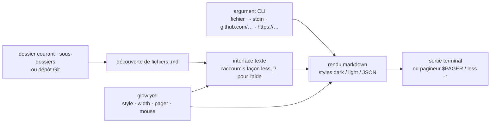

# charmbracelet/glow

> **Un lecteur de markdown en terminal qui trouve les fichiers du dossier ou du dépôt Git et les met en forme.**

## Le problème

Lire un README ou une note de documentation sans quitter le terminal laisse le choix entre
`cat`, qui affiche la syntaxe brute, et un éditeur ou un navigateur, qui casse le fil de
travail. Et quand on ne sait plus où se trouve le fichier markdown cherché dans une
arborescence, il faut d'abord le retrouver avant même de pouvoir l'ouvrir.

## Ce que ça fait vraiment

Glow est un binaire unique en Go qui fait deux choses. Lancé sans argument, il ouvre une
interface texte : il **découvre** les fichiers markdown du dossier courant et des
sous-dossiers, ou, si l'on se trouve dans un dépôt Git, cherche dans le dépôt, puis les
affiche dans son pagineur — les raccourcis de `less` y fonctionnent, `?` liste les touches.

Lancé avec un argument, il se comporte en commande de mise en forme : un chemin de fichier,
`-` pour l'entrée standard, une adresse `github.com/owner/repo` ou `gitlab.com/...` dont il
récupère le README, ou une URL HTTP vers un fichier `.md`. Les réglages documentés sont la
largeur de retour à la ligne (`-w`), le passage dans un pagineur (`-p`, qui retombe sur
`less -r` si `$PAGER` n'est pas défini), et le style (`-s dark`, `-s light`, ou un fichier
JSON de style ; sans le drapeau, Glow tente de détecter la couleur de fond du terminal). Les
mêmes options se figent dans un `glow.yml` ouvert par `glow config` : `style`, `mouse`,
`pager`, `width`, `all`, `showLineNumbers`, `preserveNewLines`.

## Comment c'est branché



Aucun diagramme tiré du code n'existe pour ce dépôt : ce schéma est reconstruit depuis le
seul README, et nomme donc des rôles, pas des fichiers source. Le README ne détaille pas
l'organisation interne du code ; il indique en revanche que les styles viennent du projet
Glamour, qui est le moteur de rendu de la famille Charm.

## Essayer

```bash
# macOS or Linux
brew install glow
```

```bash
# Debian/Ubuntu
sudo mkdir -p /etc/apt/keyrings
curl -fsSL https://repo.charm.sh/apt/gpg.key | sudo gpg --dearmor -o /etc/apt/keyrings/charm.gpg
echo "deb [signed-by=/etc/apt/keyrings/charm.gpg] https://repo.charm.sh/apt/ * *" | sudo tee /etc/apt/sources.list.d/charm.list
sudo apt update && sudo apt install glow
```

```bash
go install charm.land/glow/v3@latest
```

Puis :

```bash
# Read from file
glow README.md

# Read from stdin
echo "[Glow](https://github.com/charmbracelet/glow)" | glow -

# Fetch README from GitHub / GitLab
glow github.com/charmbracelet/glow

# Fetch markdown from HTTP
glow https://host.tld/file.md
```

```bash
glow -w 60
glow -s [dark|light]
glow -s mystyle.json
glow --help
```

Pour compiler depuis les sources (Go 1.21+ selon le README) :

```bash
git clone https://github.com/charmbracelet/glow.git
cd glow
go build
```

## Coût et pièges

- **Gratuit, sans compte ni clé.** Le dépôt est sous MIT et le binaire tourne en local.
- **Réseau dès qu'on dépasse le fichier local** : `glow github.com/...` et `glow https://...`
  vont chercher le document à distance. Le paquet Debian et le paquet RPM passent par
  `repo.charm.sh`, l'infrastructure de l'éditeur, avec sa clé GPG à installer dans les
  trousseaux du système. C'est la raison de l'alerte : rien n'est facturé, mais l'installation
  recommandée sur ces distributions ajoute un dépôt tiers. `brew`, `pacman`, `winget`, le
  binaire des *releases* ou `go install` évitent ce point.
- **Rendu couleur dépendant du terminal** : sans `-s`, Glow tente de détecter la couleur de
  fond ; si la détection se trompe, le texte peut être illisible, et il faut forcer
  `-s dark` ou `-s light`. Le README signale aussi que le support de la molette (`mouse`) et
  les numéros de ligne (`showLineNumbers`) ne valent qu'en mode interface texte.
- **Le chemin du fichier de configuration n'est pas donné en clair** : le README renvoie à
  `glow --help` pour le connaître selon la plateforme.
- **Version Go minimale 1.21** pour la compilation depuis les sources ; les autres voies
  n'exigent rien.

## Ce que ce n'est pas

- **Ce n'est pas un éditeur.** Glow lit et met en forme ; il n'écrit pas de markdown. `glow
  config` ouvre le fichier de configuration dans `$EDITOR`, c'est le seul endroit où l'on
  saisit quelque chose.
- **Ce n'est pas un aperçu en direct** : rien dans le README n'indique de rechargement quand
  le fichier change sous le pagineur.
- **Ce n'est pas un convertisseur** : pas de sortie HTML, PDF ou autre format documentée — la
  cible est le terminal, avec ses séquences ANSI.
- **Ce n'est pas un client de documentation générale** : il récupère du markdown (fichier,
  entrée standard, README GitHub ou GitLab, URL HTTP), pas des pages web quelconques.
- **Ce n'est pas la bibliothèque de rendu** : le moteur de styles est Glamour, projet
  distinct ; Glow en est l'emballage en ligne de commande.

## Alternatives

| | Quand le préférer |
|---|---|
| **charmbracelet/glamour** | Nommée dans le README pour la galerie de styles : c'est la bibliothèque Go de rendu markdown sur laquelle repose l'affichage. À préférer si l'on veut *intégrer* le rendu dans son propre programme Go plutôt que lancer une commande. |
| **charmbracelet/bubbletea** | Voisin du catalogue, de la même famille Charm : cadre d'écriture d'interfaces texte. Sans rapport avec la lecture de markdown, mais c'est la brique à prendre pour construire soi-même une interface du même genre. |

Les autres voisins proposés (`charmbracelet/lipgloss`, `charmbracelet/bubbles`) ne sont pas
comparables : ce sont respectivement une bibliothèque de mise en forme de texte terminal et un
recueil de composants d'interface, des dépendances de construction et non des lecteurs de
markdown. Aucune alternative de même fonction — un autre lecteur markdown en terminal — n'est
nommée dans le README ni présente dans les voisins.

## Pour toi

À adopter, c'est un outil de confort à coût nul : une commande, aucune dépendance à gérer,
et le gain est immédiat sur le quotidien d'un profil data / MLOps qui vit dans des sessions
SSH et des conteneurs pleins de README, de *model cards* et de notes d'architecture.
`glow github.com/owner/repo` pour jauger un dépôt sans ouvrir de navigateur est l'usage qui
justifie l'installation à lui seul. À ne pas attendre : l'édition, l'aperçu en direct d'un
document qu'on écrit, ou l'export vers un autre format.
