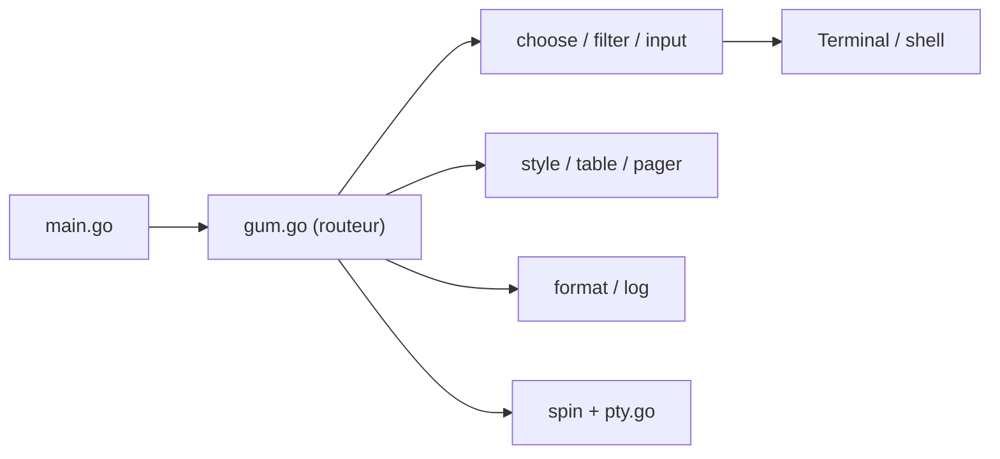

# charmbracelet/gum

> Binaire Go qui ajoute menus, saisies et mise en forme aux scripts shell, sans écrire de Go.

## Le problème
Les scripts shell interactifs sont laids et pénibles : `read`, `select` et codes ANSI à la main.

## Ce que ça fait vraiment
Sous-commandes composables : `choose`, `confirm`, `file`, `filter` (fuzzy), `format`, `input`, `join`, `pager`, `spin`, `style`, `table`, `write`, `log`. Elles lisent stdin ou des arguments, affichent une interface dans le terminal et écrivent le résultat sur stdout, avec un code de sortie pour `confirm`. Options par drapeaux ou variables d'environnement `GUM_*`.

## Comment c'est branché


## Essayer
```bash
brew install gum
gum choose "fix" "feat" "docs"
gum confirm "Commit changes?" && git commit -m "$SUMMARY"
gum spin --spinner dot --title "Buying Bubble Gum..." -- sleep 5
```

## Coût et pièges
Gratuit, aucune clé. Le paquet s'installe par gestionnaire de paquets, binaire ou `go install`.

## Ce que ce n'est pas
Ce n'est pas une bibliothèque TUI : il sert aux scripts, pas à construire une application interactive complète.

## Alternatives
Aucune alternative nommée dans le README (il s'appuie sur Bubbles et Lip Gloss).

## Pour toi
Adopter : rend tes scripts d'orchestration (choix de dépôt, de branche, de modèle, confirmation) plus sûrs en quelques lignes.

