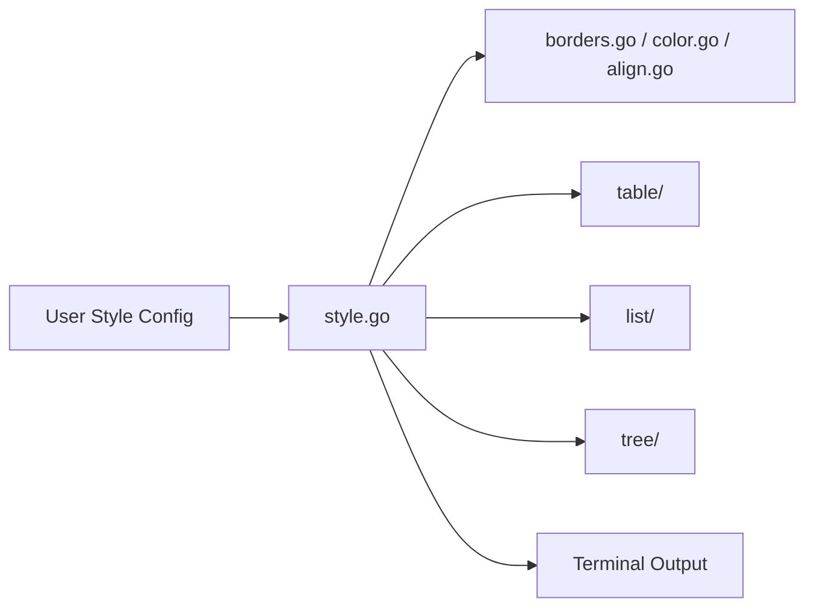

# charmbracelet/lipgloss

> Bibliothèque Go de mise en forme déclarative pour interfaces en terminal, façon CSS.

## Le problème
Assembler des vues de terminal (couleurs, marges, bordures, alignement) à la main est fastidieux.

## Ce que ça fait vraiment
Une API chaînée `NewStyle()` gère couleurs (ANSI 16, 256, TrueColor avec réduction automatique), bordures, marges, alignement, largeur/hauteur. Des utilitaires assemblent des blocs (`JoinHorizontal`, `Place`, compositeur de calques), et des sous-paquets rendent tableaux, listes et arbres.

## Comment c'est branché


## Essayer
```bash
go get charm.land/lipgloss/v2
```

## Coût et pièges
Gratuit. Migration depuis la v1 : guide dédié, paquet `compat` pour les couleurs adaptatives.

## Ce que ce n'est pas
Pas un framework d'application : il accompagne Bubble Tea sans le remplacer, et n'est pas un moteur Markdown (voir Glamour).

## Alternatives
Glamour, cité par le README, pour un rendu Markdown centré document.

## Pour toi
Surveiller : utile seulement si tu écris des outils en Go avec une interface terminal soignée.

