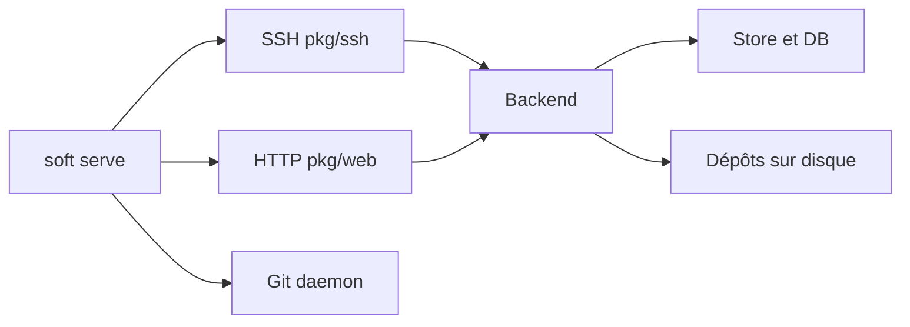

# charmbracelet/soft-serve

> Serveur Git auto-hébergé en binaire unique, piloté par SSH avec interface terminal.

## Le problème
Héberger quelques dépôts Git privés sans installer une forge lourde.

## Ce que ce n'est pas comme une forge : il sert les dépôts en SSH, HTTP et protocole git, avec une TUI accessible par `ssh`.

## Ce que ça fait vraiment
Un binaire `soft` sert les dépôts par SSH, HTTP(S) et git://, gère utilisateurs, clés publiques, jetons d'accès, collaborateurs, webhooks, hooks serveur, miroirs et Git LFS. Métadonnées en SQLite ou PostgreSQL, dépôts sur disque. Administration entièrement par commandes SSH.

## Comment c'est branché


## Essayer
```bash
brew install charmbracelet/tap/soft-serve
SOFT_SERVE_INITIAL_ADMIN_KEYS="$(cat ~/.ssh/id_ed25519.pub)" soft serve
ssh -p 23231 localhost repo create icecream
```

## Coût et pièges
Gratuit. Par défaut l'accès anonyme est en lecture seule ; les variables `SOFT_SERVE_ANON_ACCESS=admin-access` donnent un accès admin sans authentification (usage local seulement). Les clés RSA récentes (SHA-2) ne sont pas supportées, préférer Ed25519.

## Ce que ce n'est pas
Pas une forge complète : pas de pull requests ni de CI intégrée, seulement hooks et webhooks.

## Alternatives
Aucune alternative nommée dans le README.

## Pour toi
À surveiller : pratique pour un remote Git léger (dotfiles, GitOps de labo), mais sans revue de code ni CI il ne remplace pas une forge d'équipe.

