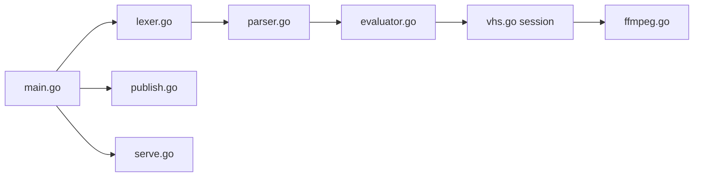

# charmbracelet/vhs

> Décrit une session terminal dans un fichier script et en génère un GIF ou une vidéo.

## Le problème
Les démos de CLI enregistrées à la main sont longues à refaire et se périment à chaque changement.

## Ce que ça fait vraiment
Un fichier `.tape` liste des commandes (Output, Set, Type, Sleep, Wait, Hide/Show, Screenshot…). VHS le lit, joue la session dans un terminal virtuel (ttyd + navigateur), capture les images et ffmpeg produit GIF, MP4, WebM ou PNG. Peut aussi enregistrer vos actions en tape, publier sur vhs.charm.sh, servir en SSH et écrire des fichiers golden (.txt/.ascii) pour tests d'intégration.

## Comment c'est branché


## Essayer
```bash
brew install vhs
vhs new demo.tape
vhs demo.tape
docker run --rm -v $PWD:/vhs ghcr.io/charmbracelet/vhs <cassette>.tape
```

## Coût et pièges
Gratuit. Requiert ttyd et ffmpeg dans le PATH (inclus dans l'image Docker). `vhs publish` envoie le GIF sur les serveurs Charm ; le serveur SSH est ouvert à tous si aucune clé autorisée n'est configurée.

## Ce que ce n'est pas
Pas un enregistreur d'écran général : il rejoue un script, il ne filme pas.

## Alternatives
Aucune alternative nommée dans le README.

## Pour toi
Très bon pour illustrer proprement un README d'outil CLI ou un tutoriel ; reproductible dans la CI, donc à adopter.

