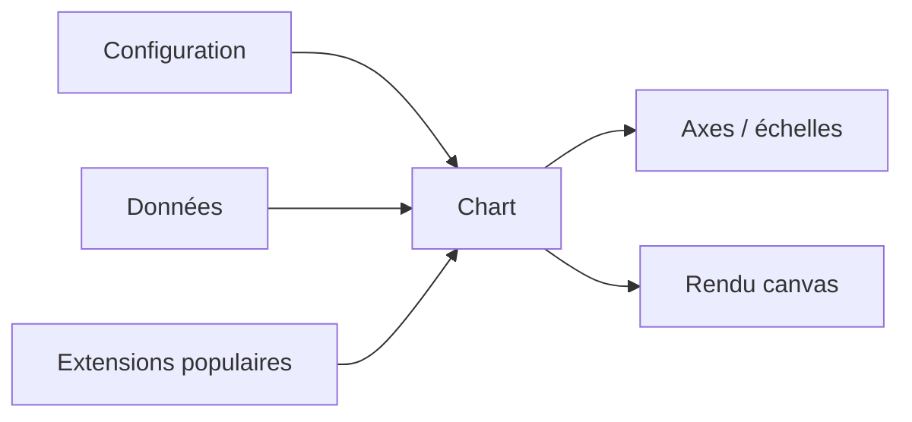

# chartjs/Chart.js

> Bibliothèque JavaScript de graphiques, pour développeurs et designers.

## Le problème
Tracer un graphique en JavaScript sans bibliothèque signifie gérer canvas, axes et échelles à la main.

## Ce que ça fait vraiment
Le README fourni ne contient qu'une ligne de description et une table des matières de documentation (Introduction, Getting Started, Configuration, Charts, Axes, Developers, Extensions, Samples). Version courante : 4. Les docs d'anciennes versions restent accessibles en précisant la version dans l'URL.

## Comment c'est branché

## Essayer
Aucune commande d'installation n'est documentée dans le README fourni.

## Coût et pièges
Gratuit. Rien d'autre n'est indiqué : ni licence, ni dépendances, ni prérequis.

## Ce que ce n'est pas
Le README est trop court pour trancher sur la couverture réelle : pas de liste de types de graphiques, pas de contraintes de navigateur, pas de modèle de performance sur gros volumes.

## Alternatives
Aucune alternative nommée dans le README.

## Pour toi
Fiche minimale : matière insuffisante. Va lire la doc officielle avant d'en tirer une décision.
