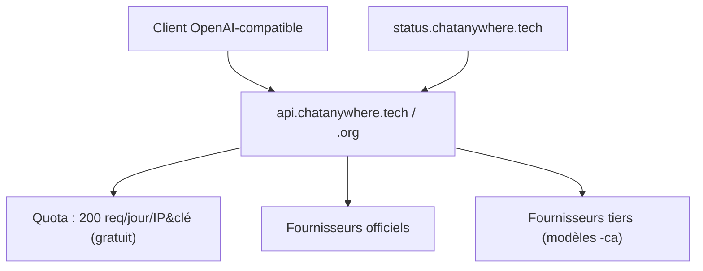

# chatanywhere/GPT_API_free

> Passerelle chinoise qui revend l'accès à des modèles via un protocole compatible OpenAI.

## Le problème
Depuis la Chine continentale, joindre les API officielles suppose un proxy, et les tarifs
officiels restent élevés pour un usage personnel.

## Ce que ça fait vraiment
Expose deux hôtes de relais, `api.chatanywhere.tech` (accéléré en Chine) et `api.chatanywhere.org`,
à substituer à `api.openai.com` dans n'importe quel client.
La clé gratuite s'obtient en liant un compte GitHub : 50 000 points par semaine, 100 requêtes par
jour, et une limite de 200 requêtes/jour par IP et par clé. La version payante lève ces limites.
Le catalogue payant couvre GPT, Claude, Gemini, DeepSeek, Qwen, Kimi, MiniMax, GLM, plus image,
TTS et embeddings, avec une grille tarifaire détaillée par modèle et par palier de contexte.

## Comment c'est branché


## Essayer
```bash
# Aucune commande dans le README : on remplace l'hôte de l'API
# par https://api.chatanywhere.tech dans son client habituel.
```

## Coût et pièges
Le README interdit explicitement l'usage commercial de la clé gratuite, réservée au personnel,
à l'éducation et à la recherche non lucrative, et annonce des bannissements en cas d'abus.
Il précise aussi que le système est « à usage d'évaluation interne » et que l'usage grand public
se fait à tes risques. Les modèles suffixés `-ca` viennent de fournisseurs tiers, moins stables ;
certaines lignes mentionnent des canaux « inversés » pour Claude.

## Ce que ce n'est pas
Ce n'est pas un logiciel : il n'y a pas de code, seulement un service et sa grille tarifaire.
Ce n'est pas un fournisseur officiel : c'est un intermédiaire, avec ce que cela implique pour
les données envoyées. La politique de confidentialité affichée n'engage que l'exploitant.

## Alternatives
Aucune alternative nommée dans le README.

## Pour toi
Sans objet hors de Chine : envoyer des données professionnelles à un relais tiers est disqualifiant.
