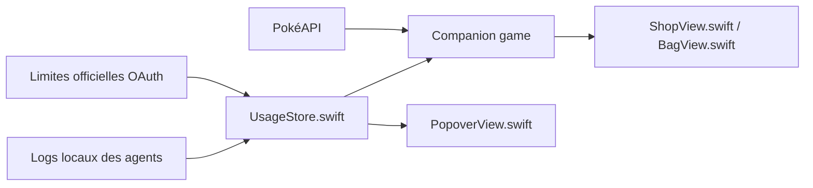

# chattymin/PokeTokenBar

> Application macOS de barre de menus qui suit la consommation de tokens des agents de code et la transforme en jeu Pokémon.

## Le problème
Connaître sa dépense de tokens et ses limites 5 h / hebdomadaires exige d'ouvrir des tableaux de bord ou de lire des logs.

## Ce que ça fait vraiment
Lit en local les logs d'une dizaine d'agents (Claude Code, Codex, Gemini CLI, Cursor, OpenCode…) et affiche usage du jour, coût, limites officielles avec compte à rebours et prévision du rythme de consommation. Les tokens font éclore et évoluer des Pokémon (données PokéAPI), avec boutique, Pokédex et animal flottant. Les limites Claude passent par un endpoint non officiel.

## Comment c'est branché


## Essayer
```bash
brew install --cask chattymin/tap/poke-token-bar
swift build
swift test
./scripts/build-app.sh
```

## Coût et pièges
Gratuit, macOS 14+. Application non notarisée. Contacte douze hôtes, dont PokéAPI, api.anthropic.com et cursor.com, sans envoyer les logs selon le README. Le Trousseau n'est lu que sur refresh manuel.

## Ce que ce n'est pas
Pas un outil de facturation fiable : Kiro est estimé, et les coûts dépendent des logs locaux. Projet fan non officiel, non commercial.

## Alternatives
Aucune alternative nommée dans le README.

## Pour toi
À surveiller : utile pour garder un œil sur ta consommation de tokens sous Mac, mais l'aspect jeu et l'endpoint non officiel le rendent fragile.

