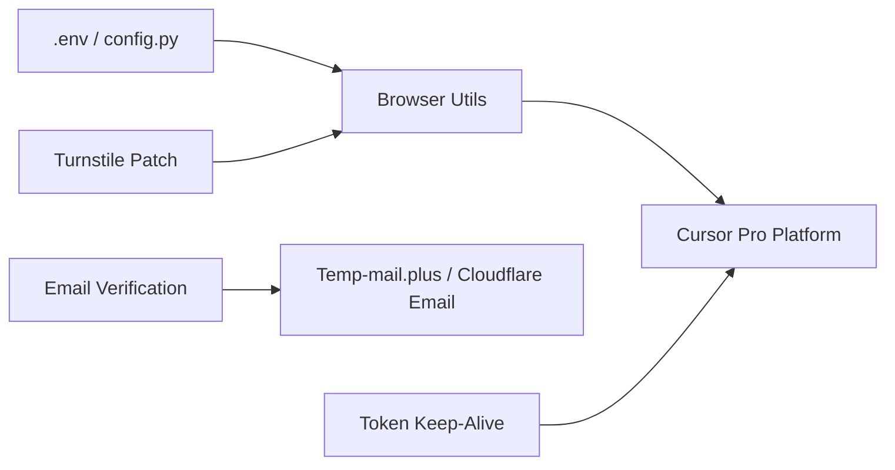

# chengazhen/cursor-auto-free

> Script Python qui automatise l'inscription de comptes Cursor Pro et le rafraîchissement de jetons pour contourner les limites d'abonnement.

## Le problème
L'auteur voulait éviter les limites d'un abonnement payant de l'éditeur Cursor en recréant des comptes automatiquement.

## Ce que ça fait vraiment
D'après l'architecture décrite : un gestionnaire d'authentification (`cursor_auth_manager.py`), une lecture de codes de vérification par e-mail (`get_email_code.py`, via Cloudflare Email ou Temp-mail.plus), un pilotage de Chrome (`browser_utils.py`) avec un correctif Turnstile, et un service de maintien de jeton (`cursor_pro_keep_alive.py`). Le README annonce lui-même que le projet est obsolète et non maintenu.

## Comment c'est branché

## Essayer
Le README ne contient aucune commande : il renvoie vers une documentation en ligne. Aucune commande reprise.

## Coût et pièges
Dépôt archivé, sans licence déclarée dans le catalogue (le README évoque CC BY-NC-ND 4.0, contradiction à vérifier). Contourner un abonnement expose à la violation des conditions du service et au blocage du compte.

## Ce que ce n'est pas
Ce n'est pas un outil de développement ni un client Cursor : c'est un contournement de restrictions commerciales, que l'auteur déconseille désormais.

## Alternatives
Le README recommande Claude Code / Codex comme solution officielle.

## Pour toi
À ignorer : archivé, abandonné par son auteur, et sa finalité (contourner un abonnement) est risquée et sans valeur pour un profil data/IA.

