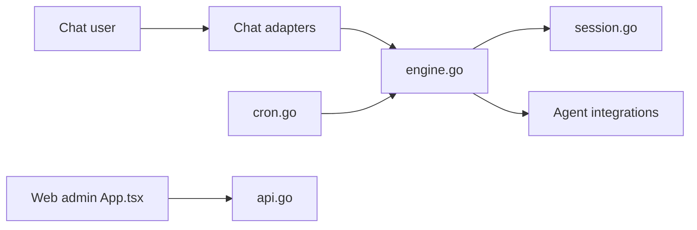

# chenhg5/cc-connect

> Pont entre agents de code locaux (Claude Code, Codex, Gemini…) et plateformes de chat comme Telegram ou Slack.

## Le problème
Un agent de code local n'est pilotable que depuis son terminal, pas depuis le téléphone ou une messagerie d'équipe.

## Ce que ça fait vraiment
Relaie les messages de 13 plateformes (Feishu, Telegram, Slack, Discord, DingTalk…) vers un agent installé en local, avec sessions par projet, commandes `/model`, `/mode`, `/dir`, tâches planifiées `/cron`, envoi de fichiers, isolation par utilisateur Unix (`run_as_user`) et interface web sur le port 9820.

## Comment c'est branché


## Essayer
```bash
npm install -g cc-connect
cc-connect
```

## Coût et pièges
Il faut installer et authentifier l'agent avant (sinon `cc-connect` quitte). Jetons de bot par plateforme. Sans licence déclarée. Le mode `/mode yolo` approuve tous les outils automatiquement.

## Ce que ce n'est pas
Ce n'est pas un agent : il relaie vers ceux que tu as installés. Le README propose aussi des collaborations commerciales.

## Alternatives
Non documenté : le README ne nomme pas d'alternative.

## Pour toi
Surveiller : pratique pour piloter un agent à distance, mais sans licence et avec un mode d'approbation totale risqué sur ta machine.

