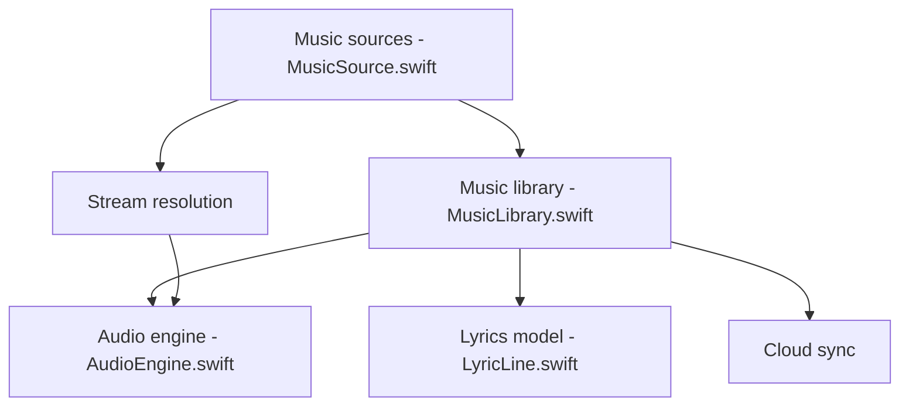

# chenqi92/primuse

> Lecteur de musique natif Apple qui réunit fichiers locaux, NAS, serveurs, clouds et Apple Music dans une seule bibliothèque.

## Le problème
Une collection musicale éclatée entre NAS, serveurs de médias et clouds oblige à jongler entre plusieurs applications.

## Ce que ça fait vraiment
Application Swift pour iPhone, iPad, Mac, Apple TV et Apple Watch. Elle se connecte à SMB, WebDAV, SFTP, Jellyfin, Plex, Navidrome, plusieurs clouds, lit de nombreux formats (FLAC, DSD, DTS via FFmpeg) et gère CUE, paroles mot à mot, scrobbling, synchronisation CloudKit et widgets. Les scrapers de métadonnées sont personnalisables par JSON et JavaScript.

## Comment c'est branché


## Essayer
```bash
git clone git@github.com:chenqi92/primuse.git
cd primuse
open Primuse.xcodeproj
xcodebuild -project Primuse.xcodeproj -scheme Primuse -destination 'generic/platform=iOS Simulator' build
swift test --package-path PrimuseKit
```

## Coût et pièges
Xcode 26+ et compte Apple Developer pour signer. L'app est publiée sur l'App Store ; Apple Music exige un abonnement. Les clés OAuth et Last.fm vont dans `Config/Secrets.local.xcconfig`. README rédigé en chinois.

## Ce que ce n'est pas
Ne fournit ni musique ni stockage cloud. UGOS et fnOS ne sont pas pris en charge comme sources NAS. Le « service intelligent » est optionnel.

## Alternatives
Aucune alternative nommée dans le README.

## Pour toi
À ignorer : lecteur musical Apple, sans rapport avec le travail data/IA/MLOps ; seul le principe de scrapers JSON et JS peut intéresser.

