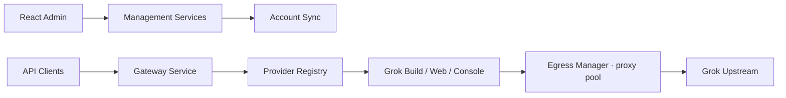

# chenyme/grok2api

> Passerelle Go multi-comptes qui expose Grok Build, Web et Console en API OpenAI/Anthropic.

## Le problème
Les trois surfaces de Grok ont chacune leur authentification, leur catalogue et leurs quotas ;
aucune ne parle le protocole que les clients type Codex ou Claude Code attendent.

## Ce que ça fait vraiment
Gère trois pools de comptes indépendants, synchronise leurs identifiants, quotas et modèles, et
publie des routes unifiées : Responses, Chat Completions, Anthropic Messages, images, vidéos
asynchrones, TTS, STT, Realtime. Console d'administration React avec tableau de bord, clés
clients à quotas, audits et facturation. Couche de sortie réseau étendue : HTTP, SOCKS, Trojan,
VLESS, Shadowsocks, VMess, pools de proxys, sondes, FlareSolverr pour Cloudflare.

## Comment c'est branché


## Essayer
```bash
git clone https://github.com/chenyme/grok2api.git
cd grok2api
cp config.example.yaml config.yaml
openssl rand -hex 32
docker compose up -d
docker compose --profile flaresolverr up -d
```

## Coût et pièges
Le README le dit d'emblée : projet « de recherche technique et d'apprentissage », à toi
d'assumer les conséquences vis-à-vis des conditions d'utilisation de Grok. Il faut des comptes
Grok valides ; les jetons Build tournent et ne doivent pas être partagés entre clients. Ne jamais
faire tourner `credentialEncryptionKey` après stockage. Les outils de compte peuvent accepter les
conditions et fabriquer une date de naissance — c'est du contournement assumé. README tronqué.

## Ce que ce n'est pas
Ce n'est pas un accès légitime à l'API xAI, ni une passerelle générique multi-fournisseurs. Ce
n'est pas un produit supporté : mainteneur unique, licence non déclarée.

## Alternatives
- **DEEIX-AI / DEEIX-Chat** : cité en tête du README comme plateforme IA intégrée.

## Pour toi
À éviter en contexte professionnel : le risque contractuel dépasse largement l'intérêt technique.
