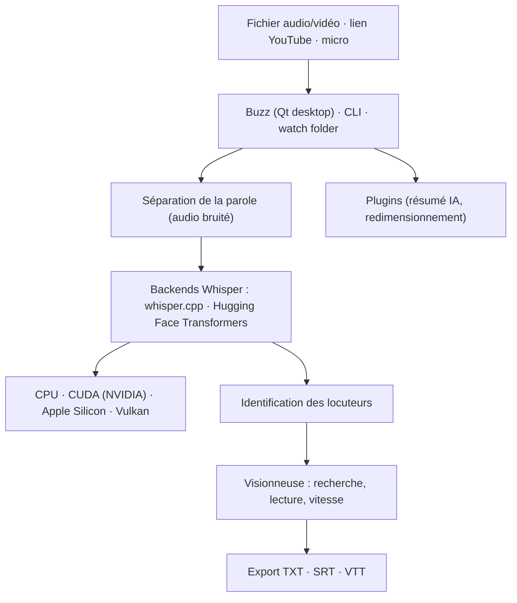

# chidiwilliams/buzz

> Application de bureau qui transcrit et traduit de l'audio hors ligne avec Whisper.

## Le problème
Transcrire une réunion ou une vidéo passe d'habitude par un service en ligne, donc par l'envoi du fichier chez un tiers.
Et Whisper en ligne de commande n'offre ni interface, ni gestion de fichiers, ni export sous-titres.

## Ce que ça fait vraiment
Transcription de fichiers audio/vidéo et de liens YouTube, plus une transcription temps réel depuis le micro.
Séparation de la parole avant transcription sur les audios bruités, et identification des locuteurs dans le média transcrit.
Export en TXT, SRT et VTT, visionneuse de transcription avec recherche, contrôle de lecture et réglage de vitesse.
Surveillance d'un dossier pour transcrire automatiquement les nouveaux fichiers, interface en ligne de commande pour le scripting, et système de plugins (résumé par IA, redimensionnement de transcription).

## Comment c'est branché


## Essayer
```bash
# Linux — Flatpak
flatpak install flathub io.github.chidiwilliams.Buzz

# Linux — Snap
sudo apt-get install libportaudio2 libcanberra-gtk-module libcanberra-gtk3-module
sudo snap install buzz

# PyPI (Python 3.12, ffmpeg requis)
pip install buzz-captions
python -m buzz

# GPU NVIDIA sous Windows pour la version PyPI
pip3 install -U torch==2.8.0+cu129 torchaudio==2.8.0+cu129 --index-url https://download.pytorch.org/whl/cu129
```

## Coût et pièges
Gratuit et hors ligne, aucune clé d'API : le coût est en CPU/GPU et en temps sur les gros fichiers.
Les installeurs macOS et Windows ne sont pas signés (avertissement à l'installation), les Mac Intel sont figés en 1.4.5, et la version PyPI exige précisément Python 3.12 plus ffmpeg.

## Ce que ce n'est pas
Ce n'est pas un service : rien n'est envoyé à OpenAI, c'est Whisper exécuté chez toi avec les limites du modèle choisi.
Ce n'est pas un outil d'édition de sous-titres : il exporte SRT/VTT, il ne fait pas le calage fin.
La traduction se limite à ce que Whisper sait faire, pas à un moteur de traduction dédié.

## Alternatives
Aucun dépôt concurrent n'est nommé dans le README ; whisper.cpp et les modèles Whisper Hugging Face y figurent comme backends, pas comme alternatives.

## Pour toi
L'outil de bureau à garder pour transcrire des entretiens ou des vidéos sans exfiltrer l'audio ; le mode CLI et le watch folder le rendent scriptable dans un pipeline.
