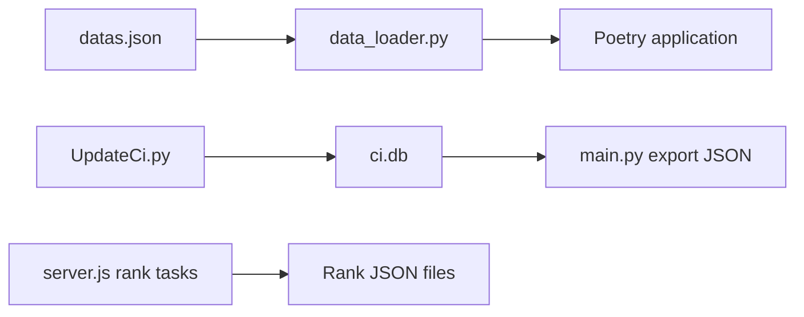

# chinese-poetry/chinese-poetry

> Base JSON de poésie chinoise classique (Tang, Song, ci…) pour développeurs d'applications de poésie ou de NLP.

## Le problème
Les grands recueils classiques existent en livres, pas sous forme exploitable par un programme. Il manque un corpus structuré et copiable.

## Ce que ça fait vraiment
Distribue en JSON environ 55 000 poèmes Tang, 260 000 poèmes Song, 21 000 ci Song et d'autres recueils (Shijing, Lunyu, Huajianji…). Un `data_loader.py` charge une collection décrite dans `datas.json`. Des scripts séparés mettent à jour les ci depuis une source distante (`UpdateCi.py`), exportent depuis SQLite (`ci.db`, `main.py`) et calculent des classements de recherche (`server.js`). Les formats internes n'ont pas été inspectés.

## Comment c'est branché


## Essayer
```bash
# Aucune commande documentée dans ce README.
# Les données sont des fichiers JSON à copier ou à charger via data_loader.py.
```

## Coût et pièges
Gratuit. Le README précise que la collecte n'a pas été journalisée (sites cibles limitant l'accès, interruptions) ; les corrections doivent citer une source.

## Ce que ce n'est pas
Ce n'est pas une application ni un modèle : uniquement des données. Leur qualité éditoriale (variantes, erreurs) repose sur les contributions, sans garantie.

## Alternatives
- PaddlePaddle/PaddleNLP : génération de poèmes à partir de ce corpus, citée dans le README.
- justdark/pytorch-poetry-gen : char-RNN de génération, cité dans le README.

## Pour toi
Surveiller : utile comme corpus pour un projet NLP en chinois classique, mais il repose sur une seule personne et sur une collecte non documentée.

