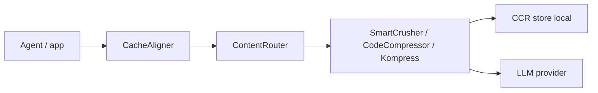

# chopratejas/headroom

> Proxy local qui compresse sorties d'outils, logs et historique avant le LLM, pour réduire les tokens.

## Le problème
Les agents de code envoient des sorties d'outils répétitives qui gonflent la facture de tokens.

## Ce que ça fait vraiment
Un routeur de contenu choisit un compresseur (JSON, code par AST, texte). Les originaux restent en cache local et le modèle les récupère via `headroom_retrieve`. Utilisable en bibliothèque, proxy, wrapper d'agent ou MCP. Mémoire partagée entre agents, `headroom learn`.

## Comment c'est branché


## Essayer
```bash
uv tool install --python 3.13 "headroom-ai[all]"
headroom wrap claude
headroom proxy --port 8787
headroom doctor
headroom dashboard
```

## Coût et pièges
Gratuit (Apache 2.0 d'après le README). Économies de 21 à 57 % sur les scénarios mesurés, très faibles sur la prose. Une balise anonyme est active par défaut (`HEADROOM_BEACON=off` pour la couper).

## Ce que ce n'est pas
Pas une compression sans effet : les gains dépendent de la répétitivité des données. La licence du catalogue est non déclarée.

## Alternatives
Le README compare avec Compresr, Token Co. et OpenAI Compaction, qui sont hébergés et non réversibles.

## Pour toi
À adopter en essai : mesure `headroom savings` sur ton trafic réel avant de généraliser, et coupe la télémétrie si besoin.
