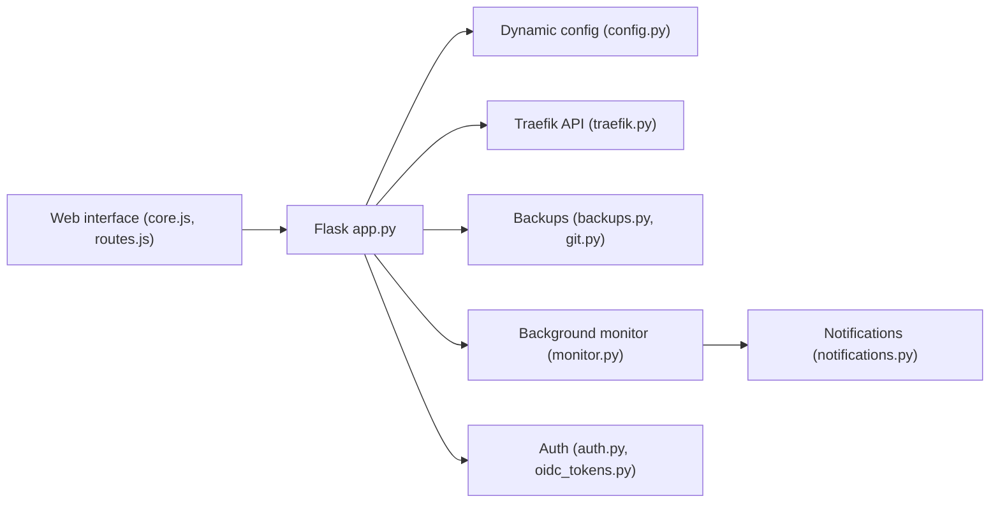

# chr0nzz/traefik-manager

> Interface web auto-hébergée pour piloter un reverse proxy Traefik sans éditer le YAML, pour homelabbers.

## Le problème
Configurer routes, middlewares et certificats Traefik à la main dans des fichiers YAML est fastidieux et source d'erreurs.

## Ce que ça fait vraiment
Application Flask (Python 3.11) qui lit et écrit les fichiers de configuration dynamique de Traefik, interroge l'API Traefik et affiche routes, services, middlewares, certificats `acme.json`, CrowdSec et logs. Elle sauvegarde avant chaque modification (option git), surveille les routes en tâche de fond et notifie (Discord, Slack, ntfy, etc.). Un agent Go optionnel gère des serveurs Traefik distants.

## Comment c'est branché


## Essayer
```bash
curl -fsSL https://get-traefik.xyzlab.dev | bash
tm status
tm doctor
```
Ou en Docker Compose : image `ghcr.io/chr0nzz/traefik-manager:latest`, port 5000, puis ouvrir `http://your-server:5000` (assistant de configuration).

## Coût et pièges
Gratuit. Il faut déjà une instance Traefik. Le script d'installation est un `curl | bash`. Les modifications de `acme.json` demandent un montage en lecture-écriture et un mode de redémarrage.

## Ce que ce n'est pas
Ce n'est pas un proxy : c'est un éditeur de configuration Traefik. Les services qu'il n'a pas écrits restent en lecture seule tant qu'on ne les « reprend » pas. Hors sujet pour un pipeline data/IA.

## Alternatives
Aucune alternative nommée dans le README.

## Pour toi
À surveiller seulement si tu héberges tes services ML derrière Traefik : sinon c'est un outil de homelab sans lien avec data/IA/MLOps, et la licence GPL-3.0 est à garder en tête si tu redistribues.

