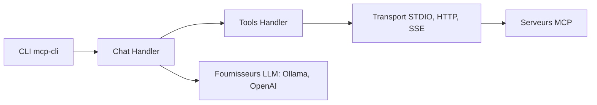

# chrishayuk/mcp-cli

> Client en ligne de commande pour dialoguer avec des serveurs MCP et des LLM locaux ou cloud.

## Le problème
Tester des serveurs MCP et enchaîner des outils avec un LLM demande beaucoup de code de colle.

## Ce que ça fait vraiment
Modes chat, interactif, commande (scriptable) et commandes directes. Par défaut Ollama avec `gpt-oss`, sans clé ; OpenAI, Anthropic, Azure, Gemini et Groq sont possibles. Gestion des serveurs, tokens en trousseau ou Vault, plans d'exécution en DAG, pièces jointes, tableau de bord navigateur, apps MCP en HTML, mémoire virtuelle expérimentale.

## Comment c'est branché


## Essayer
```bash
ollama pull gpt-oss
uvx mcp-cli --help
mcp-cli --server sqlite
mcp-cli cmd --server sqlite --tool list_tables --output tables.json
```

## Coût et pièges
Gratuit en local (Ollama, modèle à télécharger). Les fournisseurs cloud demandent une clé à ta charge. Certains serveurs (Notion, Monday) passent par OAuth.

## Ce que ce n'est pas
Ce n'est pas un serveur MCP. Le README est très long et empile des fonctions expérimentales (mémoire virtuelle, planification) : à tester une à une.

## Alternatives
Aucune alternative nommée dans le README.

## Pour toi
À surveiller : bon banc d'essai pour serveurs MCP en local sans clé, mais mainteneur individuel et licence non déclarée.
