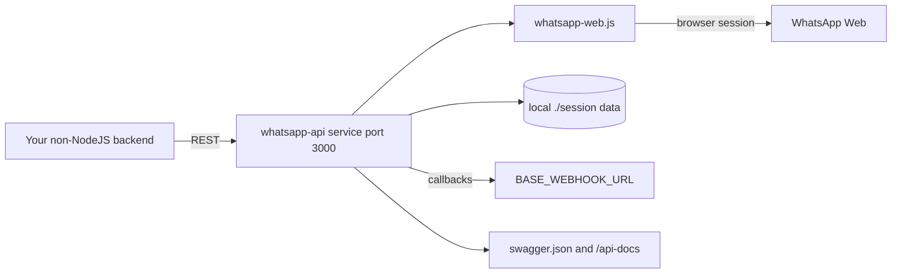

# chrishubert/whatsapp-api

> **Self-hosted REST gateway to WhatsApp Web for non-NodeJS backends; the project is deprecated.**

## The problem

WhatsApp has no open API. Sending a message from a Python, PHP or Go backend means driving a WhatsApp Web session yourself: QR pairing, session persistence, event handling. `whatsapp-web.js` already solves that, but only as a NodeJS library you embed in your own code.

## What it actually does

It wraps [whatsapp-web.js](https://github.com/pedroslopez/whatsapp-web.js) in an HTTP service. REST endpoints start, terminate and health-check multiple concurrent sessions, each with a unique id, with session data stored locally and restored when the server starts. The README lists sending image, video, audio, document, file URL, button, contact and list messages, setting status, updating the profile picture, "is on WhatsApp" checks, blocking users, and full group management: create, leave, list, invite, promote and demote admins, invite code, participants, settings, subject, description. Four callbacks are pushed to a webhook: QR code, new message, status change, media attachment. A global API key can protect every endpoint, and individual callbacks can be disabled. A banner at the top of the README states the project is deprecated and unmaintained, pointing to the fork `avoylenko/wwebjs-api`.

## How it is wired



An external client talks REST to the service, which delegates the real WhatsApp Web session to `whatsapp-web.js`. Session data is written under `./session` and reloaded on restart. Events go out to `BASE_WEBHOOK_URL`, overridable per session with `<sessionId>_WEBHOOK_URL` and filterable with `DISABLED_CALLBACKS`. The OpenAPI description lives in `swagger.json` and is served at `/api-docs` when `ENABLE_SWAGGER_ENDPOINT` is set.

## Trying it

```bash
git clone https://github.com/chrishubert/whatsapp-api.git
cd whatsapp-api
docker-compose pull && docker-compose up
```

Then open `http://localhost:3000/session/start/ABCD`, scan the console QR code from WhatsApp mobile (Linked Devices → Link a Device), and call `http://localhost:3000/client/getContacts/ABCD`. Callback payloads land in `./session/message_log.txt`. Without Docker:

```bash
npm install
cp .env.example .env
npm run start
npm run test
```

## Cost and traps

The code is free and runs on your own machine; the cost sits elsewhere. The README warns plainly that WhatsApp allows neither bots nor unofficial clients and that the author cannot guarantee you will not be blocked — the risk lands on a real phone number. You need a WhatsApp account to pair by QR, Docker or Node to host, and one persistent browser session per client, so RAM and disk grow with session count. For production the README requires disabling `ENABLE_LOCAL_CALLBACK_EXAMPLE`, setting `API_KEY` (endpoints are otherwise open), and calling `/api/terminateInactiveSessions` periodically so dead sessions stop consuming resources. Structural trap: the project is deprecated and unmaintained, and GitHub reports the licence as `NOASSERTION` while the README claims MIT.

## What it is not

It is not the official WhatsApp Business API: the README states the project is not affiliated with or authorised by WhatsApp, and going through WhatsApp Web offers no compliance guarantee. It is not a turnkey messaging platform either — no UI, no queue, no conversational logic; it is a thin HTTP layer over `whatsapp-web.js`, inheriting both its reach and its limits. And it is no longer a living project: the header sends you to the fork `avoylenko/wwebjs-api`, so adopting it here starts with technical debt.

## Alternatives

- [avoylenko/wwebjs-api](https://github.com/avoylenko/wwebjs-api): the fork the README itself names as actively maintained — the place to go if the need is real.
- [pedroslopez/whatsapp-web.js](https://github.com/pedroslopez/whatsapp-web.js): the underlying library, preferable when your app is already NodeJS and needs no REST layer.
- devlikeapro/waha, from the supplied neighbours, targets the same self-hosted WhatsApp HTTP gateway ground; the other neighbours (HivisionIDPhotos, dagger, gotenberg) are not comparable.

## For you

Limited value for a data / AI / MLOps profile, except in one narrow case: plugging an LLM agent into a WhatsApp test channel without writing NodeJS. Even then, the deprecated status, the single maintainer and the documented account-ban risk argue for starting from the maintained fork. Keep it as an architecture reference — persistent sessions, filterable webhooks, a global API key — rather than a production building block.
