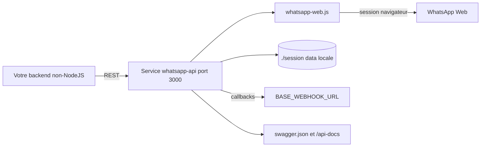

# chrishubert/whatsapp-api

> **Passerelle REST auto-hébergée vers WhatsApp Web, pour brancher un backend non-NodeJS ; projet déprécié.**

## Le problème

WhatsApp n'expose pas d'API ouverte : pour envoyer un message depuis un backend Python, PHP ou n'importe quel service hors NodeJS, il faut piloter soi-même une session WhatsApp Web, gérer le QR code, la persistance de session et la réception d'événements. `whatsapp-web.js` fait ce travail, mais seulement en tant que bibliothèque NodeJS embarquée dans votre code.

## Ce que ça fait vraiment

Ce dépôt enveloppe la bibliothèque [whatsapp-web.js](https://github.com/pedroslopez/whatsapp-web.js) dans un service HTTP. Il expose des endpoints REST pour ouvrir, terminer et surveiller plusieurs sessions simultanées, identifiées par un id unique, avec les données de session sauvegardées localement et restaurées au démarrage du serveur. Côté messages, le README liste l'envoi d'image, vidéo, audio, document, URL de fichier, bouton, contact, liste, la mise à jour du statut et de la photo de profil, le test « is on WhatsApp », le blocage d'utilisateur, et toute la gestion de groupe (création, invitation, admin/démotion, sujet, description, réglages, participants). En sortie, quatre callbacks sont poussés vers un webhook : QR code, nouveau message, changement de statut, pièce jointe média. Tous les endpoints peuvent être protégés par une clé d'API globale, et chaque callback peut être désactivé individuellement. Le README affiche en tête un avertissement : le projet est déprécié et n'est plus maintenu, le fork actif étant `avoylenko/wwebjs-api`.

## Comment c'est branché



Un client externe parle en REST au service, qui délègue à `whatsapp-web.js` la session WhatsApp Web réelle. Les données de session sont écrites sur disque dans `./session` et rechargées au redémarrage. Les événements repartent en webhook vers `BASE_WEBHOOK_URL`, surchargeable par session via `<sessionId>_WEBHOOK_URL`, et filtrables par `DISABLED_CALLBACKS`. La documentation OpenAPI vit dans `swagger.json`, servie sur `/api-docs` si `ENABLE_SWAGGER_ENDPOINT` est actif.

## Essayer

```bash
git clone https://github.com/chrishubert/whatsapp-api.git
cd whatsapp-api
docker-compose pull && docker-compose up
```

Puis visiter `http://localhost:3000/session/start/ABCD`, scanner le QR affiché dans la console depuis WhatsApp mobile (Appareils liés → Lier un appareil), et appeler `http://localhost:3000/client/getContacts/ABCD`. Les callbacks reçus sont visibles dans `./session/message_log.txt`. En local sans Docker :

```bash
npm install
cp .env.example .env
npm run start
npm run test
```

## Coût et pièges

Le code est gratuit et tourne chez vous ; le coût réel est ailleurs. Le README prévient explicitement que WhatsApp n'autorise ni bots ni clients non officiels et que l'auteur ne peut pas garantir l'absence de blocage de compte : c'est le risque principal, et il porte sur un numéro de téléphone réel. Il faut un compte WhatsApp à lier par QR code, Docker ou Node pour héberger, et une session navigateur persistante par client — donc de la RAM et du disque qui montent avec le nombre de sessions. Pour la production, le README impose de désactiver `ENABLE_LOCAL_CALLBACK_EXAMPLE`, de poser `API_KEY` (sans quoi les endpoints sont ouverts), et d'appeler périodiquement `/api/terminateInactiveSessions` pour que les sessions mortes ne consomment plus de ressources. Piège de fond : le projet est déprécié et non maintenu, et la licence remontée par GitHub est `NOASSERTION` alors que le README annonce MIT.

## Ce que ce n'est pas

Ce n'est pas l'API officielle WhatsApp Business : le README précise que le projet n'est ni affilié ni autorisé par WhatsApp, et passer par WhatsApp Web n'a aucune garantie de conformité. Ce n'est pas non plus une plateforme de messagerie clé en main : pas d'interface, pas de file d'attente, pas de logique conversationnelle — c'est une couche HTTP mince au-dessus de `whatsapp-web.js`, dont elle hérite les capacités et les limites. Et ce n'est plus un projet vivant : l'en-tête renvoie vers le fork `avoylenko/wwebjs-api`, donc toute adoption ici part avec une dette.

## Alternatives

- [avoylenko/wwebjs-api](https://github.com/avoylenko/wwebjs-api) : le fork désigné par le README lui-même comme la version activement maintenue — c'est là qu'il faut aller si le besoin est réel.
- [pedroslopez/whatsapp-web.js](https://github.com/pedroslopez/whatsapp-web.js) : la bibliothèque sous-jacente, à préférer si votre application est déjà en NodeJS et n'a pas besoin d'une couche REST.
- devlikeapro/waha, parmi les voisins fournis, joue sur le même terrain de la passerelle HTTP WhatsApp auto-hébergée ; les autres voisins proposés (HivisionIDPhotos, dagger, gotenberg) ne sont pas comparables.

## Pour toi

Intérêt limité pour un profil data / IA / MLOps, sauf cas précis : brancher un agent LLM sur un canal WhatsApp de test sans écrire de NodeJS. Même alors, le statut déprécié, le mainteneur unique et le risque documenté de blocage de compte poussent à partir directement du fork maintenu. À ranger comme référence d'architecture — session persistante, webhooks filtrables, clé d'API globale — plutôt que comme brique à mettre en production.
