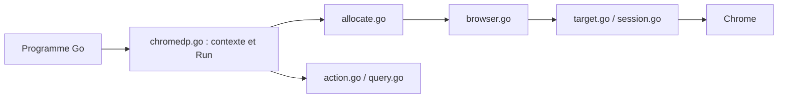

# chromedp/chromedp

> Bibliothèque Go pour piloter un navigateur Chrome via le protocole DevTools, sans dépendance externe.

## Le problème
Automatiser un navigateur (captures, scraping, tests) demande souvent Selenium ou un serveur intermédiaire.

## Ce que ce n'est pas — erreur de champ corrigée
(voir plus bas)

## Ce que ça fait vraiment
Crée un contexte navigateur, y exécute des actions (navigation, requêtes d'éléments, saisie, JavaScript, captures d'écran, PDF, émulation d'appareil) et observe les événements de la page. Un allocateur lance Chrome (headless par défaut) ou se connecte à une instance existante via websocket.

## Comment c'est branché


## Essayer
```bash
go get -u github.com/chromedp/chromedp
```
Le README renvoie à la référence Go et au dépôt d'exemples pour le code.

## Coût et pièges
Gratuit, mais il faut un Chrome installé ; en environnement sans écran, l'image `chromedp/headless-shell` est recommandée. Sous Linux, Chrome est tué à la fin du programme.

## Ce que ce n'est pas
Pas un outil clé en main : c'est une bibliothèque Go, pas une CLI. Les erreurs « context canceled » signalent la perte de connexion au navigateur.

## Alternatives
- Aucune alternative nommée dans le README.

## Pour toi
À surveiller seulement si tu fais du scraping ou de la capture de pages en Go ; sinon un profil data/IA en Python n'en a pas l'usage.

