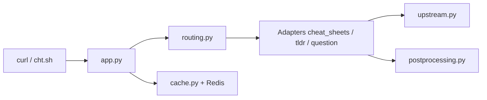

# chubin/cheat.sh

> Aide-mémoire de commandes et de langages, interrogeable avec curl depuis un terminal, pour développeurs.

## Le problème
Retrouver la syntaxe de `tar` ou d'une fonction de liste implique de quitter le terminal pour un moteur de recherche.

## Ce que ça fait vraiment
Un service HTTP répond à des chemins de type `cheat.sh/tar` ou `cht.sh/python/random+list+elements`. Il agrège des dépôts communautaires (tldr, cheat, learnxinyminutes, cheat.sheets) et des réponses de StackOverflow, formate en code du langage demandé et retire les commentaires sur demande. Le client `cht.sh` ajoute mode shell, historique et complétion. Il existe des plugins d'éditeurs (Vim, Emacs, VS Code…). Docker Compose lance le service et Redis.

## Comment c'est branché


## Essayer
```bash
curl cheat.sh/tar
curl cht.sh/python/random+list+elements
curl https://cht.sh/:cht.sh > "$PATH_DIR/cht.sh"
docker-compose up
```

## Coût et pièges
Gratuit, sans compte. Le service public dépend du serveur du projet ; les requêtes lui sont envoyées. Le mode Docker est une « early implementation » réservée à un usage interne, de dev ou personnel. Dernier push : 23 décembre 2025.

## Ce que ce n'est pas
Pas un dépôt de cheat sheets propre : il relaie des sources externes, et une réponse générée peut ne pas être exacte à 100 %.

## Alternatives
- tldr-pages/tldr : source amont, consultable hors ligne.
- cheat/cheat : autre source amont de fiches de commandes.

## Pour toi
Adopter pour dépanner en ligne de commande sans quitter le terminal, en sachant que tes requêtes passent par un service tenu par une seule personne.

