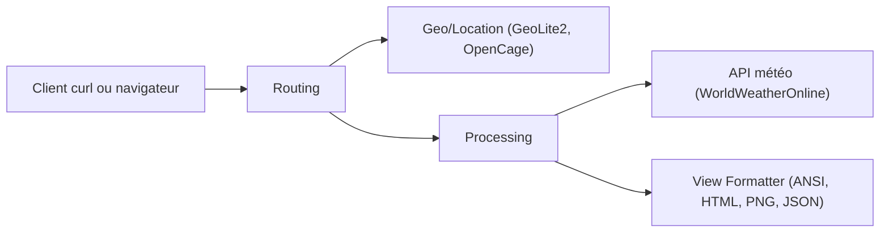

# chubin/wttr.in

> Service météo interrogeable avec curl : texte ANSI, HTML, PNG, JSON ou Prometheus.

## Le problème
Consulter la météo depuis un terminal, une barre d'état ou un script oblige à passer par une API avec clé ou par un site web.

## Ce que ça fait vraiment
`curl wttr.in/Ville` renvoie un rapport en texte ; des paramètres choisissent le format (une ligne, JSON j1, Prometheus p1, vue riche v2, carte v3), les unités, la langue et la phase de lune. Localisation par nom, aéroport, adresse IP ou domaine. Il s'intègre à tmux, WeeChat et conky. Le README décrit aussi l'auto-hébergement : binaire Go unique avec GeoLite2 et OpenCage.

## Comment c'est branché


## Essayer
```bash
curl wttr.in
curl wttr.in/London
curl 'wttr.in/Nuremberg?format=3'
curl wttr.in/Detroit?format=j1
curl wttr.in/Moon
```

## Coût et pièges
Usage public gratuit ; en cas d'auto-hébergement il faut un compte MaxMind et un jeton OpenCage. Le README recommande un intervalle de mise à jour raisonnable dans tmux et propose wttr.is comme domaine de secours. Le README fourni est tronqué au milieu de la partie Prometheus.

## Ce que ce n'est pas
Pas une API de données météo primaire : les données viennent d'un fournisseur amont. Le mode v2 est expérimental, uniquement en terminal et en anglais.

## Alternatives
- wego : wrapper d'origine du projet, cité dans le README.

## Pour toi
À adopter pour un usage ponctuel : pas d'installation, format j1 exploitable dans un script, mais tu dépends d'un service public.

