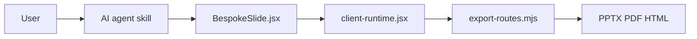

# chuspeeism/dashi-ppt-skill

> Skill d'agent IA qui génère des présentations éditables dans le navigateur, exportables en PPTX ou PDF.

## Le problème
Un PPT généré par IA est difficile à retoucher ensuite ; la correction prend plus de temps que la génération.

## Ce que ça fait vraiment
À partir d'un document, l'agent compose un deck (12 thèmes, 1 020 mises en page) servi comme éditeur web : texte modifiable sur place, curseurs pour la disposition et le nombre de modules, remplacement d'images. Export HTML hors ligne, PDF ou PPTX éditable via Chrome/Chromium/Edge. Le README assure qu'aucun contenu n'est envoyé à un serveur.

## Comment c'est branché


## Essayer
```bash
npx dashi-ppt-skill@latest
npm --prefix <project> run export:pptx -- <sortie>/ppt sortie.pptx
npm --prefix <project> run export:pdf  -- <sortie>/ppt
```

## Coût et pièges
Node 20+ et Chrome/Chromium/Edge pour l'export. Environ 100 000 jetons pour un deck de 10 pages, payés via ton agent. AGPL-3.0. Une vérification de version sort sur le réseau ; l'aperçu local est accessible sur le réseau local.

## Ce que ce n'est pas
Ce n'est pas un outil pixel-perfect : la personnalisation reste volontairement limitée. Ne convient pas à un chatbot web sans Node local.

## Alternatives
Non documenté : le README ne nomme pas d'alternative.

## Pour toi
Surveiller : utile pour produire des supports rapidement avec un agent, mais jeune, à un seul mainteneur, AGPL, et coûteux en jetons.

