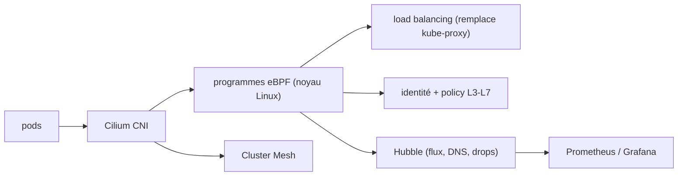

# cilium/cilium

> Réseau, observabilité et sécurité pour Kubernetes, avec un plan de données en eBPF.

## Le problème
Filtrer par adresse IP oblige à modifier les pare-feux de tous les serveurs dès qu'un conteneur démarre.
Comprendre pourquoi un paquet a été rejeté dans un cluster relève de la devinette.

## Ce que ça fait vraiment
Plugin CNI qui fournit un réseau L3 plat, en encapsulation (VXLAN, Geneve) ou en routage natif, extensible à plusieurs clusters.
Équilibrage de charge distribué en eBPF via tables de hachage : remplace entièrement kube-proxy, avec DSR et hachage Maglev en entrée nord-sud.
Politiques réseau fondées sur une identité de sécurité et non sur l'IP, de L3 à L7 : méthode HTTP, chemin d'URL, appel gRPC, domaines FQDN.
Cluster Mesh pour la découverte de services entre clusters ; Hubble pour les cartes de services temps réel et les causes de rejet.

## Comment c'est branché

## Essayer
Aucune commande d'installation n'est écrite dans le README : il renvoie au guide « Installing Cilium » et donne les tags d'images, par exemple `quay.io/cilium/cilium:v1.20.2`.

## Coût et pièges
Gratuit, mais suppose un cluster Kubernetes et un noyau Linux compatible eBPF : c'est de l'infrastructure, pas un paquet.
Trois versions mineures seulement sont maintenues (v1.20, v1.19, v1.18) ; au-delà, c'est en fin de vie.

## Ce que ce n'est pas
Ce n'est pas mono-licence : l'espace utilisateur est Apache 2.0, mais les modèles de code BPF sont en double licence GPL-2.0 / BSD-2-Clause.
Ce n'est pas un produit à tester en `main` : les images issues de la branche principale sont explicitement hors production.
Ce n'est pas un service mesh à proxy : c'est l'argument inverse, éviter le coût des architectures à sidecar.

## Alternatives
kube-proxy : le composant que Cilium remplace, si l'équilibrage basique suffit.
Gateway API : Cilium en est une implémentation conforme, l'alternative étant une autre implémentation.

## Pour toi
Hors périmètre : sujet d'infrastructure réseau, à laisser à l'équipe plateforme.
